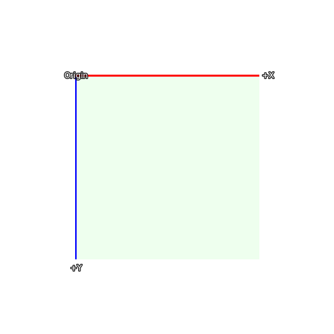
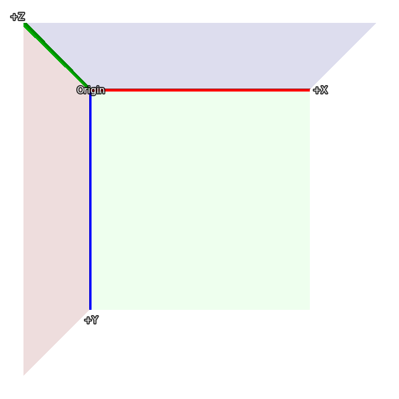
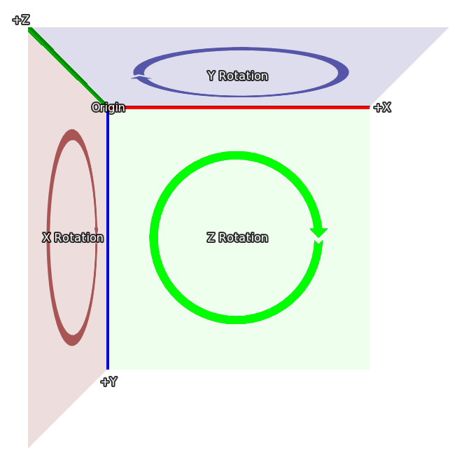

.. _3dstage:

3D Stage
========

The 3D Stage, named after the stages that plays are performed on, is a concept
that allows displayables to be positioned in 3 dimensions. Ren'Py will then
render the displayables with the proper perspective, and will also make the
z dimension avalable, to make things like lighting and depth rendering
possible.

Coordinates
-----------

Probably the most important thing to understand about the 3D Stage is the
coordinate system that Ren'Py uses for the 3D state. Here's the coordinate
system that's used to place displayables in 2D:

In 2D, the rectangle is the size of the screen, and the width and height
of the visible area is set using :func:`gui.init` (usually when first making
a new game).

The 3D stage extends this coordinate system with a new axis, one facing
towards the viewer, so that values greater than 0 bring an image closer
(and make it bigger), and those less than 0 move the image away from the viewer
(and make it smaller).

Finally, when a rotation in 3d happens, it's in the directions given here:

* When rotating around Z, X moves toward Y.
* When rotating around X, Y moves toward Z.
* When rotating around Y, Z moves toward X.

These coordinate systems are based on those used in Ren'Py, making it
easy to move from 2D to the 3D stage. When importing 3D models, coordinate
transforms may be applied to ensure the model coordinates are sensible.

Camera
------

The initial placement of the camera is controlled by the parameters to
:func:`gui.init`. First, Ren'Py uses `width` and `fov` to compute the
default `z` distance. For the default `fov` of 75:

* When width = 1280, z is about 834
* When width = 1920, z is about 1251
* When width = 3840, z is about 2502

Where the actual value of z is less than 1 higher than the values given
here. The default z placement can be overridden with the :tpref:`perspective`
style property, or the :var:`config.perspective` variable.

Ren'Py automatically applies an offset of (`width` / 2, `height` / 2, `z`)
to the camera, and it looks down the -Z axis.

The `z` distance is also the distance from the camera to the plane where
pixels on-screen have the same size as they do in the original images (ignoring
window scaling). Increasing the camera's z position will make everything
smaller, while decreasing it will make everything bigger.

Finally, :tpref:`perspective` and :var:`config.perspective` describe the
near and far planes, defaulting to 100 and 100000, respectively. This
means than when an image is closer than 100 z-units from the camera,
it disappears, and it also disappears if it's more than 100,000 z-units
away.

Using the 3D Stage
------------------

The first thing to do to use the 3D stage is to enable it for a layer, using
the ``camera`` statement. This is usually done with::

    camera:
        perspective True

though it's possible that you'll want to include a default camera position, as
described below.

Showing images (backgrounds and sprites) works the same way as it does in
when using 2D coordinates. ::

    scene bg washington

    show lucy mad at right

    show eileen happy

However, it's possible to use transforms to move these displayables in
three dimensional space::

    scene bg washington:
        xalign 0.5 yalign 1.0 zpos -1000

    show lucy mad:
        xalign 1.0 yalign 1.0 zpos 100

    show eileen happy:
        xalign 0.5 yalign 1.0 zpos 200

As an ATL transform is given, the default transform is not used, and it's
necessary to specify :tpref:`xalign` and :tpref:`yalign` to position the
displayable in the x and y axes. Of course, transforms can also be used. ::

    transform zbg:
        zpos -100

    transform z100:
        zpos 100

    transform z200:
        zpos 200

    scene bg washington at center, zbg

    show lucy mad at right, z100

    show eileen happy at center, z200

If you try this, you'll see an empty space around the background. That's
because by moving it back, it becomes smaller, and doesn't fill the screen.
Ren'Py has an easy way of fixing this problem - :tpref:`zzoom`. Setting
the tpref:`zzoom` property to True will scale an image by the amount it was shrunk
due to having a negative zpos. It's useful for backgrounds. ::

    transform zbg:
        zpos -100 zzoom False

It's also possible to use ATL to vary zpos, just like you would xpos and
ypos. ::

    show eileen happy at center:
        zpos 0
        linear 4.0 zpos 200

Note that zpos can interact strangely with positions like ``left`` and ``right``,
and with :propref:`xalign` and :propref:`yalign`. That's because Ren'Py will
position the images in a three dimensional rectangular volume (like a cube, but
not all the sides are the same length), and then apply perspective to the image,
which can cause parts of the image to move offscreen.

It's possible to move the camera, as well, using ``camera``. For example, ::

    camera:
        perspective True
        xpos 0
        linear 3.0 xpos 500

When doing this, it probably makes sense to use background images that are
larger than the window.

If you apply a zpos to a sprite, and it doesn't take effect, the reason is
probably because you omitted the ``perspective`` clause of the ``camera``
transform.

The camera can be rotated, with::

    camera:
        perspective True
        rotate 45

As the camera is what is rotating, the rotation is in the opposite
direction as one that rotates a displayable.

Depth
-----

By default, Ren'Py will display the images in its usual order, with the last
image to be shown above the others. This might lead to odd results, like
an image that is closer (using perspective) beign shown behind one that's
farther away.

If your game shows images out of order like this, you can tell the GPU
to sort by depth, using :tpref:`gl_depth`::

    camera:
        perspective True
        gl_depth True

Slight rounding errors can cause images that are nominally at the same depth to
appear above or below each other. Flattening these images and displaying them
together may be the solution to this.

Matrix Transforms
-----------------

Ren'Py uses the :tpref:`matrixtransform` transform property to apply a matrix
to displayables, which allows an image to be scaled, offset, and rotated in
three-dimensional space. This property takes either a :func:`Matrix` or a
TransformMatrix (defined below), and applies it to the vertices at the corners
of the images being displayed.

Ren'Py uses the :tpref:`matrixanchor` transform property to make applying a
matrix easier. This defaults to (0.5, 0.5), and is translated to a pixel offset
inside the image being transformed using the usual Ren'Py anchor rules. (If it's
an integer or abolute, it's considered a number of pixels, otherwise it's a
fraction of the size of the image.)

Ren'Py applies the image by first shifting the image so the anchor is at (0, 0, 0).
It then applies the transform, and then shifts it back by the same amount. Using
the defaults, this means that the matrix will be applied to the center of the
image.

For example::

    show eileen happy at center:
        matrixtransform RotateMatrix(45, 0, 0)

Will rotate the image around the line going horizontally through it's center. The
top of the image will move back, and then bottom of the image will move
forwards.

Matrixes can be chained together with multiplication. It's easiest to think
about them being applied right to left. In this example::

    show eileen happy at center:
        matrixtransform RotateMatrix(45, 0, 0) * OffsetMatrix(0, -300, 0)

The image will be shifted up by 300 pixels, and then will be rotated around
the X axis.

TransformMatrix
---------------

While Matrix objects are suitable for static transformations, they're not
useful for animating changing transformations. It's also useful to have a way of
taking common matrices and encapsulating them in a way that allows the
matrix to be parameterized.

The TransformMatrix is a base class that is is extended by a number of
Matrix-creating classes. Instances of TransformMatrix are called by Ren'Py,
and return Matrixes. TransformMatrix is well integrated with ATL, allowing
for matrixtransform animations. ::

    transform xrotate:
        matrixtransform RotateMatrix(0.0, 0.0, 0.0)
        linear 4.0 matrixtransform RotateMatrix(360.0, 0.0, 0.0)
        repeat

Subclasses of TransformMatrix are expected to implement the ``__call__`` method.
This method takes:

* An old object to interpolate off of. This object may be of any class,
  and may be None if no old object exists.
* A value between 0.0 and 1.0, representing the point to interpolate.
  0.0 is entirely the old object, and 1.0 is entirely the new object.

Built-In TransformMatrix Subclasses
-----------------------------------

The following is the list of TransformMatrix subclasses that are built into
Ren'Py.

.. include:: inc/transform_matrix

Transform Properties
--------------------

The following transform properties are used by the 3D Stage.

    :tpref:`perspective`, :tpref:`matrixanchor`, :tpref:`matrixtransform`, :tpref:`zpos`, :tpref:`zzoom`

.. transform-property:: matrixanchor

    :type: (position, position)
    :default: (0.5, 0.5)

    This gives the position of the matrix anchor relative to the image. If the
    variables are floats, this is relative to the size of the child, otherwise
    it's absolute pixels.

    This sets the location of the (0, 0, 0) point that matrixtransform applies
    its transform to.

.. transform-property:: matrixtransform

    :type: None or Matrix or TransformMatrix
    :default: None

    If not None, this gives a matrix that is used to transform the vertices
    of the child of the transform. The transformation goes from the coordinates
    used by the screen to the coordinates used by the child of the transform.

.. transform-property:: perspective

    :type: True or False or Float or (Float, Float, Float)
    :default: False

    When applied to a transform, this enables perspective rendering. This
    takes a triple, giving the near plane, z-distance to the 1:1 plane, and
    far plane.

    If a single float, the distances to the near and far planes are taken
    from :var:`config.perspective`. If True, all three values are taken
    from that variable.

    When perspective is not false, the meaning of the :tpref:`xpos`, :tpref:`ypos`,
    :tpref:`zpos`, and :tpref:`rotate` are inverted, providing the effect of positioning the
    camera rather than the child.

    As the perspective transformation assumes it's aligned wiht the window,
    it doesn't make sense to reposition it using :tpref:`xanchor`, and :tpref:`yanchor`,
    or properties that set those, such as :tpref:`anchor`, :tpref:`align`, :tpref:`center`,
    etc.

.. transform-property:: zpos

    :type: float
    :default: 0

    This offsets the child along the z-axis. When perspective is false,
    this is used directly, otherwise it is multiplied by -1 and used.

    If setting this causes the child to disappear, it's likely that the
    transform is not being used with a displayable where zpos is False.

.. transform-property:: zzoom

    :type: bool
    :default: False

    If this is true, the z-distance to the 1:1 plane (`zone`) is determined,
    along with this displayable's zpos. The child is then scaled by (`zone` - `zpos`) / `zone`
    in the x and y axes.

    The intended use for this is in displaying a background with a negative `zpos`, which
    would normally make the background small. Setting this to true means that the background
    will be displayed at 1:1 size.

