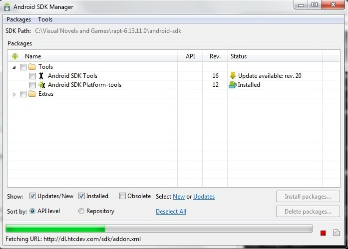
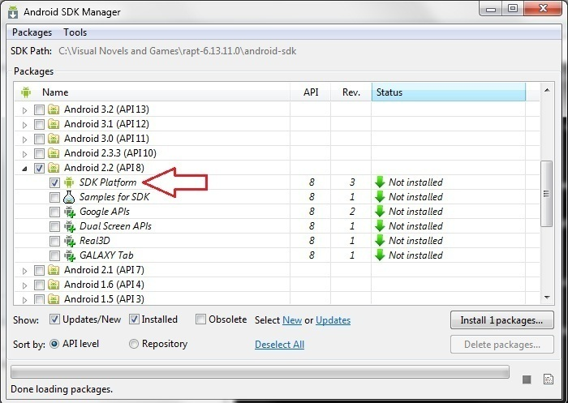

.. highlight:: none

Building Android Applications
=============================

Ren'Py contains tools that help you take a packaging-centric approach
to Android game development. In this approach, you will use a PC to
build an Android package and upload it to your device. You can then
run the game like any Android application. When it works correctly,
you can upload the package you make to Google Play and other app
stores.

Building an Android application takes four or five steps:

1. Download and install RAPT, the Java Development Kit,
   and Android USB Drivers (scroll down for links).

2. Use the launcher to install the Android SDK and create keys.

3. Use the launcher to configure the Android build.

4. Optionally, add Google Play keys.

5. Use the launcher to build the Android application.

Once you've finished these steps, you'll have a runnable Android
package. You'll only need to run step 3 when you decide to make changes to your
game's configuration or when configuring a new game entirely; you'll run step
5 most often, whenever you need to make a new build of your game.

Step 1: Installing the Dependencies
-----------------------------------

There are three things you may need to manually download and install
before you can build packages:

**Java Development Kit.**
The Java Development Kit (JDK) contains several tools that are used by
|PGS4A|, including the tools used to generate keys and sign
packages. It can be downloaded from:

    http://www.oracle.com/technetwork/java/javase/downloads/index.html

Please note that the developer-focused JDK is different from the
user-focused JRE, and you'll need the JDK to create Android packages.

**Android Device Drivers.**
On Windows, you may want to install a device driver to access
your device, although this is not necessary. Links to android device drivers can be found at:

    http://developer.android.com/sdk/oem-usb.html

On Linux or OS X, you won't need a device driver. If you can't access
your device, you may need to read:

    http://developer.android.com/guide/developing/device.html#setting-up

However, modern versions of Linux and OS X should just work.

**RAPT.**
The latest version of RAPT can be downloaded from:

    http://www.renpy.org/dl/android

Once RAPT has been downloaded, you should unpack it in side the
Ren'Py directory. (The directory that contains renpy.exe, renpy.sh,
and the Ren'Py app.) Then restart the launcher to ensure that it
detects the presence of RAPT.

Step 2: Set up the Android SDK and Development Environment
----------------------------------------------------------

The next step is to set up the Android SDK and the rest of your
development environment. This step will:

* Check that the JDK is installed properly.
* Install Apache Ant.
* Install the Android SDK.
* Use the Android SDK to install the appropriate development
  packages.
* Create a signing key that will be used to sign packages that are
  placed on the market (android.keystore: this will be generated in the RAPT directory).

This step requires Internet access.

To perform this step, choose "Install SDK & Create Keys" from the
Android screen in the Ren'Py Launcher.

RAPT will report on what it's doing. It will also prompt you with
warnings about licenses, and ask if you want it to generate a key.

.. warning::

   The key generated by RAPT is created with a standard
   passphrase. You should really use keytool to generate your own
   signing keys.

    http://docs.oracle.com/javase/1.3/docs/tooldocs/win32/keytool.html

   At the very least, you should keep the android.keyring file in
   a safe place. You should also back it up, because without the
   key, you won't be able to upload the generated applications.

Step 3: Configure Your Game
---------------------------

Before building a package, you must give |PGS4A| some information
about your game. You can do this with the following command::

    android.py configure mygame

This will ask you a series of questions about your game, and store
that information in a file in the game directory.

If you need to change the information - for example, if you release a
new version of your game - you can re-run the configure command. Your
previous choices will be remembered.

Step 4: Build and Install the Package
-------------------------------------

Finally, you can build and install the package. This is done with a
command like::

    android.py build mygame release install

This command will build a releasable version of your game, and then
install it on the connected device. Please look at the output of this
command to make sure it succeeds.

Once the game successfully installs, you can touch its icon in your
device's launcher to start it running.

If you'd rather just copy the game's apk file to your Android device manually, you can just run::

    android.py build mygame release

Then navigate to the 'bin' directory inside |PGS4A| and copy the file mygame-release.apk into your Android Device.
You will then need to find the .apk file in your Android device using your file application and open it to install the
game.

The build command passes the options after the game name to the ant
tool, which is responsible for creating the Android package. Other
commands are also possible - for a list, run::

    android.py build mygame help

Viewing Debug Output
--------------------

To view debug output from your application, run the logcat command::

    android.py logcat

This command runs the ``adb logcat`` command in a mode that selects
only Python output.

Troubleshooting and Support
---------------------------

Here's a list of errors that you might encounter and possible solutions:

When trying to run::

    android.py test

After having associated .py files with Python 2.7, if you get::

    Traceback (most recent call last):
    File "C:\Visual Novels and Games\rapt-6.13.11.0\android.py", line 9, in <module>
        import subprocess
    File "C:\Python27\lib\subprocess.py", line 444, in <module>
        from _subprocess import CREATE_NEW_CONSOLE, CREATE_NEW_PROCESS_GROUP
    ImportError: cannot import name CREATE_NEW_PROCESS_GROUP

This may be related to having more than one version of Python installed on your system.
Try running android.py with the full path to Python, e.g.::

    C:\python27\python.exe android.py test

(If this works, then you will need to include the full path to Python in every command,
as if you didn't have the file type associated.)

If while downloading Apache Ant you get::

    IOError: [Errno socket error] [Errno 10054] An existing connection was forcibly
    closed by the remote host

Just try installing the sdk again with the same command.

If while configuring your game you get something like::

    Tag <manifest> attribute package has invalid character '-'.

You may have inserted an invalid character in the package name you used during
configuration (in this case a hyphen '-'). You'll have to use a different
package name which does not contain anything other than letters and dots.

If while configuring you get something like::

    Traceback (most recent call last):
    File "android.py", line 66, in <module>
        main()
    File "android.py", line 44, in main
        configure.configure(iface, directory)
    File "buildlib\configure.py", line 108, in configure
        config.save(directory)
    File "buildlib\configure.py", line 30, in save
        with file(os.path.join(directory, ".android.json"), "w") as f:
    IOError: [Errno 2] No such file or directory: 'mygame\\.android.json'

You should check whether you specified the correct path to your game directory. The easiest
way to be sure is to put your game's directory inside the |PGS4A| directory, and simply supply
the name of your game's directory. (If your game's directory name has spaces, you may need
to surround it with double quotes.)

If building your game gives you an error like:

    Error: Target id android-8 is not valid. Use 'android list targets' to get the target ids

You might want to check whether you have Android 2.2 (API 8) in the Android SDK manager.
You can run it by navigating to the android-sdk/tools directory inside the |PGS4A| directory
and run android.bat.

If Android 2.2 (API 8) is missing like in the above image, click 'Updates' and then 'Install Updates'.

Once the updates are installed, make sure Android 2.2 (API 8) and SDK platform are ticked:

And install the packages. Then, try building your game again.

.. ifconfig:: is_renpy

    If you still have questions or doubts you can try searching through or posting on the
    |PGS4A| thread over at the Lemmasoft forums:

        http://lemmasoft.renai.us/forums/viewtopic.php?f=32&t=13987&hilit=rapt

Expansion APKs
--------------

|PGS4A| optionally supports the use of expansion APKs when used on a
device supporting Google Play. Please see:

    http://developer.android.com/google/play/expansion-files.html

For information about expansion APKs work. Right now, only the
main expansion APK is supported, giving a 2GB limit.

.. ifconfig:: not is_renpy

    When an android APK is created, all assets (from the assets
    directory) are placed in the expansion APK. The assets can be
    accessed through the :module:`android.assets` interface.

.. ifconfig:: is_renpy

    When an APK is created, all game files will be placed in the
    expansion APK. Ren'Py will transparently use these files.

|PGS4A| will place the expansion APK on the device when installing
the APK package on the device. In normal operation, Google Play will
place the expansion APK on the device automatically.

