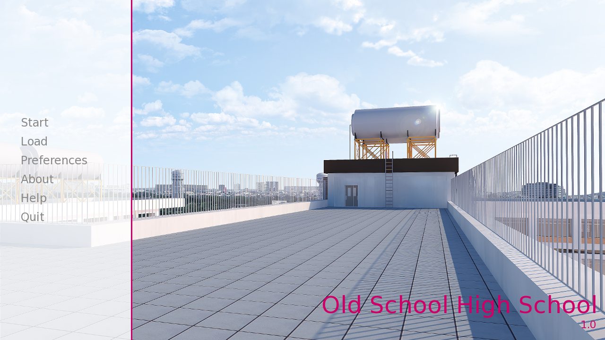
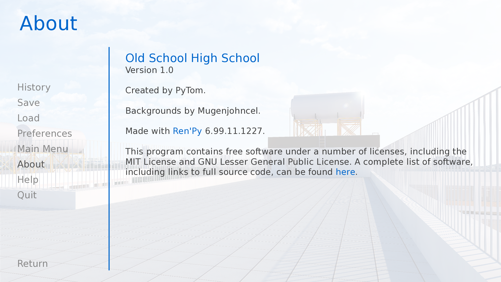
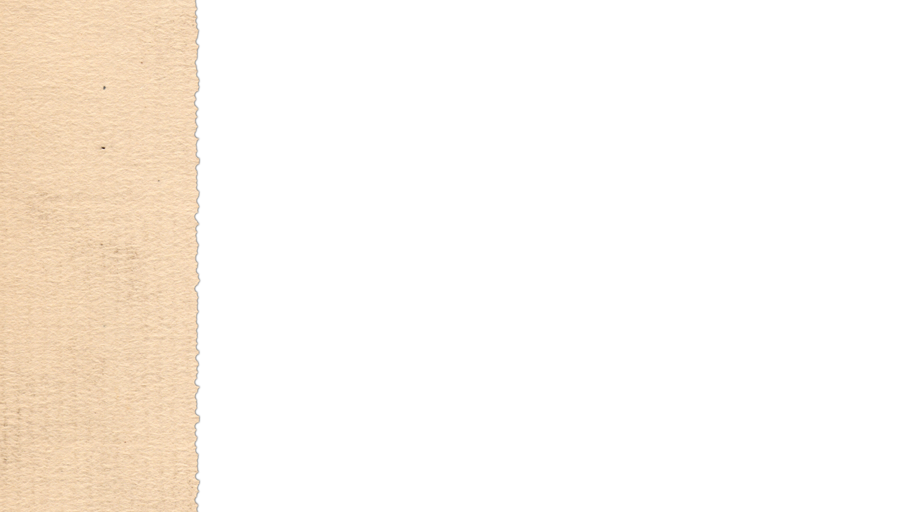
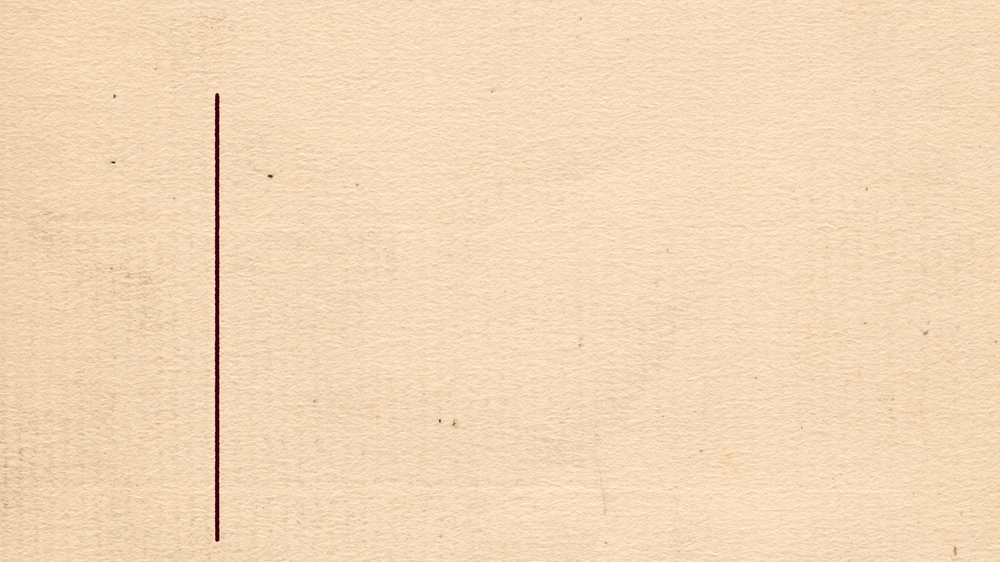
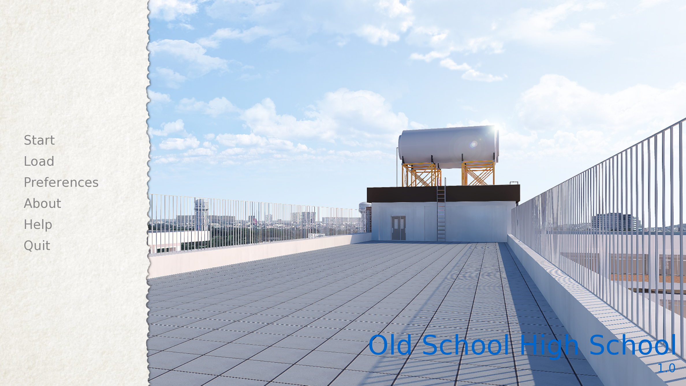
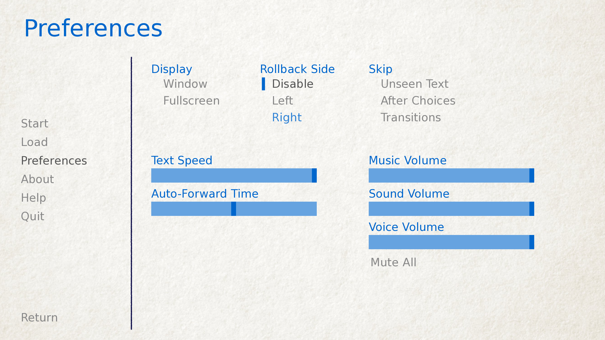

.. _gui:

=======================
GUI Customization Guide
=======================

Ren'Py features a GUI system that (we hope) looks attractive out of the box,
can be customized somewhat, and can be replaced entirely if necessary. This
page explains how to do simple and intermediate levels of GUI customization.

For more advanced customization, please take a look at the documentation for
:ref:`styles <styles>` (including the list of :ref:`style properties <style-properties>`
and :ref:`screens <screens>` (including
:ref:`screen actions <screen-actions>` and :ref:`special screens <screen-special>`).

This assumes that you're using a new-style Ren'Py GUI (contained in the gui.rpy
file). Older GUIs (that use the screens.rpy file) should be treated as advanced
gui customization for the purposes of this guide.

Simple GUI Customization
========================

There are a few simple pieces of GUI customization that make sense for
all but the simplest visual novels. What these customizations have in
common is that they do not require editing gui.rpy. These customizations
change the GUI somewhat, but do not drastically change the look of the
GUI.

Change Size and Colors
----------------------

The easiest thing to change about the GUI is to change the size and
color of the GUI. Ren'Py will prompt you to make these choices when
you first create a project, but choosing "Change/Update GUI" in the
launcher will let you change your choice.

When changing the GUI through the launcher, Ren'Py will prompt if you
want to simply change the launcher, or update gui.rpy. Both choices
will overwrite most image files, and overwriting gui.rpy will get rid
of changes to that file.

As a result, you probably want to do this before any other customization.

Ren'Py will prompt for the default resolution of the project, and then
also for the color scheme to use. Once you select those, it will update
the GUI to match your choices.

Options.rpy
-----------

There are a couple of variables in options.rpy that are used by the
gui code.

:var:`config.name`
    A string giving a human-readable name for the game. This is used as the
    window title, and throughout the GUI wherever the title of the
    game is needed.

:var:`config.version`
    A string giving the version of the game. This is presented to the
    user in various places.

:var:`gui.about`
    Additional text that is added to the about screen. If you want multiple
    paragraphs of credits, \\n\\n can be used to separate the paragraphs.

Here's an example of these three defines::

    define config.name = _('Old School High School')

    define config.version = "1.0"

    define gui.about = _("Created by PyTom.\n\nHigh school backgrounds by Mugenjohncel.")

For convenience, it might make sense to define gui.about using a triple-quoted
string, in which case line endings are respected. ::

    define gui.about = _("""\
    Created by PyTom.

    High school backgrounds by Mugenjohncel.""")

Game and Main Menu Background Images
-------------------------------------

The images used by the GUI can be found in the game/gui directory,
which can be opened by choosing "Open Directory: gui" from the
launcher. The relevant files are:

gui/main_menu.png
    A file that contains an image that is used in the background of
    all screens of the main menu.

gui/game_menu.png
    A file that contains an image that is used in the background of
    all screens of the game menu.

    The main menu, with only gui/main_menu.png replaced.

    The about screen can be part of the game menu (using gui/game_menu.png
    as the background) or the main menu (using gui/main_menu.png as the
    background). Both can be set to the same image.

Window Icon
-----------

The window icon is the icon that is displayed (in places like the Windows
task bar and Macintosh dock) by a running application.

The window icon can be changed by replacing gui/window_icon.png.

Note that this only changes the icon used by the running game. To change
the icon used by Windows .exe files and Macintosh applications, see the
:ref:`build documentation <special-files>`.

Intermediate GUI Customization
==============================

Next, we will demonstrate the intermediate level of GUI customization.
At the intermediate level, it's possible to change the colors, fonts,
and images used by the game. In general, intermediate customization
keeps the screens mostly the same, with buttons and bars in the same
places, although modifying the screens to add new functionality
is certainly possible.

Overlay Images
--------------

There are also a pair of overlay images. These are used to darken or
lighten the background image to make buttons and other user interface
components more readable. These images are in the overlay directory:

gui/overlay/main_menu.png
    The overlay used by the main menu screen.

gui/overlay/game_menu.png
    The overlay used by game-menu-like screens, including load, save,
    preferences, about, help, etc. This overlay is selected by the
    screen in question, and is used even when at the main menu.

Here are a pair of example overlay images, and what the game looks like
with the overlay images added.

    An example gui/overlay/main_menu.png image.

    An example gui/overlay/game_menu.png image.

    The main menu after changing the overlays.

    The game menu after changing the overlays.

Other
-----

::

    screen ctc():
        style_prefix "ctc"

        # Place on top of normal screens.
        zorder 1

        hbox:
            spacing gui.scale(6)

            xalign 1.0
            xoffset gui.scale(-20)
            yalign 1.0
            yoffset gui.scale(-20)

            text "▶" at delayed_blink(2.0, 3.0) style "ctc_triangle"
            text "▶" at delayed_blink(2.2, 3.0) style "ctc_triangle"
            text "▶" at delayed_blink(2.4, 3.0) style "ctc_triangle"

    style ctc_triangle:
        # We have to use a font that has the BLACK RIGHT-POINTING TRIANGLE glyph
        # in it.
        color gui.accent_color
        font gui.glyph_font

