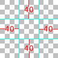
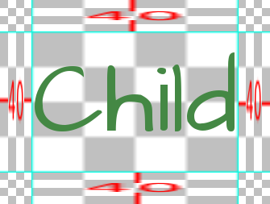
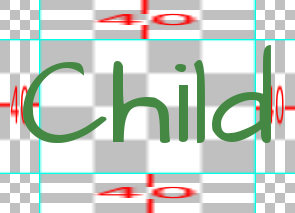
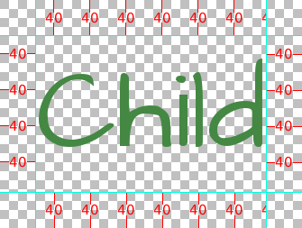

.. _gui:

=======================
GUI Customization Guide
=======================

.. ifconfig:: not renpy_figures

    .. note::

        This version of the documentation has the images omitted to
        save space. To view the full version, please visit
        https://www.renpy.org/doc/html/gui.html

Ren'Py features a GUI system that (we hope) looks attractive out of the box,
can be customized somewhat, and can be replaced entirely if necessary. This
page explains how to do simple and intermediate levels of GUI customization.

For more advanced customization, please take a look at the documentation for
:doc:`styles <style>` (including the list of :doc:`style properties <style_properties>`)
and :doc:`screens <screens>` (including :doc:`screen actions <screen_actions>`
and :doc:`special screens <screen_special>`).

This assumes that you're using a new-style Ren'Py GUI (contained in the :file:`gui.rpy`
file). Older GUIs (that use the :file:`screens.rpy` file) should be treated as advanced
GUI customization for the purposes of this guide.

Simple GUI Customization
========================

There are a few simple pieces of GUI customization that make sense for
all but the simplest visual novels. What these customizations have in
common is that they do not require editing :file:`gui.rpy`. These customizations
change the GUI somewhat, but do not drastically change the look of the
GUI.

Change Size and Colors
----------------------

The easiest thing to change about the GUI is to change the size and
color of the GUI. Ren'Py will prompt you to make these choices when
you first create a project, but choosing "Change/Update GUI" in the
launcher will let you change your choice.

When changing the GUI through the launcher, Ren'Py will prompt if you
want to simply change the launcher, or update :file:`gui.rpy`. Both choices
will overwrite most image files, and overwriting :file:`gui.rpy` will get rid
of changes to that file.

As a result, you probably want to do this before any other customization.

Ren'Py will prompt for the default resolution of the project, and then
also for the color scheme to use. Once you select those, it will update
the GUI to match your choices.

Options.rpy
-----------

There are a couple of variables in :file:`options.rpy` that are used by the
GUI.

:var:`config.name`
    A string giving a human-readable name for the game. This is used as the
    window title, and throughout the GUI wherever the title of the
    game is needed.

:var:`gui.show_name`
    This should be set to False to hide the title and version number from
    the main menu. (Say, because the title is "baked into" the main menu
    image.)

:var:`config.version`
    A string giving the version of the game. This is presented to the
    user in various places in the default GUI. It has other uses apart
    from that, such as error messages or tracebacks.

:var:`gui.about`
    Additional text that is added to the about screen. If you want multiple
    paragraphs of credits, \\n\\n can be used to separate the paragraphs.

Here's an example of these defines::

    define config.name = _('Old School High School')

    define gui.show_name = True

    define config.version = "1.0"

    define gui.about = _("Created by PyTom.\n\nHigh school backgrounds by Mugenjohncel.")

For convenience, it might make sense to define gui.about using a triple-quoted
string, in which case line endings are respected. ::

    define gui.about = _("""\
    Created by PyTom.

    High school backgrounds by Mugenjohncel.""")

Game and Main Menu Background Images
-------------------------------------

The images used by the GUI can be found in the game/gui directory,
which can be opened by choosing "Open Directory: gui" from the
launcher. The relevant files are:

gui/main_menu.png
    A file that contains an image that is used in the background of
    all screens of the main menu.

gui/game_menu.png
    A file that contains an image that is used in the background of
    all screens of the game menu.

.. ifconfig:: renpy_figures

    .. figure:: gui/easy_main_menu.jpg
        :width: 100%

        The main menu, with only :file:`gui/main_menu.png` replaced.

    .. figure:: gui/easy_game_menu.jpg
        :width: 100%

        The about screen can be part of the game menu (using :file:`gui/game_menu.png`
        as the background) or the main menu (using :file:`gui/main_menu.png` as the
        background). Both can be set to the same image.

Window Icon
-----------

The window icon is the icon that is displayed (in places like the Windows
task bar and Macintosh dock) by a running application.

The window icon can be changed by replacing :file:`gui/window_icon.png`.

Note that this only changes the icon used by the running game. To change
the icon used by Windows .exe files and Macintosh applications, see the
:ref:`build documentation <special-files>`.

Intermediate GUI Customization
==============================

Next, we will demonstrate the intermediate level of GUI customization.
At the intermediate level, it's possible to change the colors, fonts,
and images used by the game. In general, intermediate customization
keeps the screens mostly the same, with buttons and bars in the same
places, although modifying the screens to add new functionality
is certainly possible.

Many of these changes involve editing variables in :file:`gui.rpy`. For example,
to increase the dialogue font size, find the line that reads::

    define gui.text_size = 22

and increase or decrease it, for example, to::

    define gui.text_size = 20

Note that the default values are often different than what's found in
this documentation. The default values can changed based on size and
colors selected for the game, and the values in this file are an example
of extensive GUI customization. It's best to search :file:`gui.rpy` for define and
the variable in question – for example, ``define gui.text_size``.

Some of the adjustments below either partially or completely effect image
files. As a result, the changes only take effect when the image files
themselves are updated, which can be done by choosing "Change GUI" in
the launcher, and telling it to regenerate image files. (But note that
doing so will overwrite any image files you have already modified.)

You may want to consider waiting until your game is nearly complete before
customizing :file:`gui.rpy` in this way. While old :file:`gui.rpy` files will work in newer
Ren'Py versions, newer :file:`gui.rpy` files may have features and fixes that older
versions lack. Customizing the GUI early may make it harder to take
advantage of such improvements.

Dialogue
--------

There are a number of relatively easy customizations that can be performed
to change how dialogue is displayed to the player. The first is changing
the textbox.

gui/textbox.png
    This file contains the background of the text window, displayed as part
    of the say screen. While this should be the full width of the game, text
    is only displayed in the central 60% of the screen, with a 20% border
    on either side.

In addition, there are a number of variables that can be customized to change
dialogue.

.. var:: gui.text_color = "#402000"

    This sets the color of the dialogue text.

.. var:: gui.text_font = "ArchitectsDaughter.ttf"

    This sets the font that is used for dialogue text, menus, inputs, and
    other in-game text. The font file should exist in the game directory.

.. var:: gui.text_size = 33

    Sets the size of the dialogue text. This may need to be increased or
    decreased to fit the selected font in the space allotted.

.. var:: gui.name_text_size = 45

    Sets the size of character names.

By default, the character name label uses the accent color. The color can
be easily changed when defining a character::

    define e = Character("Eileen", who_color="#104010")

.. ifconfig:: renpy_figures

    .. figure:: oshs/game/gui/textbox.png
        :width: 100%

        An example textbox image.

    .. figure:: gui/easy_say_screen.jpg
        :width: 100%

        Dialogue customized using the textbox image and the variable
        settings given above.

Choice Menus
------------

The choice screen is used by the menu statement to display choices to
the player. Again, there  are some relatively easy customizations that
can be performed on the choice screen. The first are the two image
files:

gui/button/choice_idle_background.png
    This image is used as the background of choice buttons that are not
    focused.

gui/button/choice_hover_background.png
    This image is used as the background of choice buttons that are focused.

By default, text is placed in the central 75% of these images. There are
also a couple of variables that control the color of the text in choice
buttons.

.. var:: gui.choice_button_text_idle_color = '#888888'

    The color used for the text of unfocused choice buttons.

.. var:: gui.choice_button_text_hover_color = '#0066cc'

    The color used for the text of focused choice buttons.

These should suffice for simple customization, where the size of the images
does not need to be changed. For more complex customizations, check out the
section on buttons, below.

.. ifconfig:: renpy_figures

    .. figure:: oshs/game/gui/button/choice_idle_background.png
        :width: 100%

        An example :file:`gui/button/idle_background.png` image.

    .. figure:: oshs/game/gui/button/choice_hover_background.png
        :width: 100%

        An example :file:`gui/button/choice_hover_background.png` image.

    .. figure:: gui/easy_choice_screen.jpg
        :width: 100%

        An example of the choice screen, as customized using the images
        and variable settings given above.

Overlay Images
--------------

There are also a pair of overlay images. These are used to darken or
lighten the background image to make buttons and other user interface
components more readable. These images are in the overlay directory:

gui/overlay/main_menu.png
    The overlay used by the main menu screen.

gui/overlay/game_menu.png
    The overlay used by game-menu-like screens, including load, save,
    preferences, about, help, etc. This overlay is selected by the
    screen in question, and is used even when at the main menu.

gui/overlay/confirm.png
    The overlay used in the confirm screen to darken the background.

.. ifconfig:: renpy_figures

    Here are a pair of example overlay images, and what the game looks like
    with the overlay images added.

    .. figure:: oshs/game/gui/overlay/main_menu.png
        :width: 100%

        An example :file:`gui/overlay/main_menu.png` image.

    .. figure:: oshs/game/gui/overlay/game_menu.png
        :width: 100%

        An example :file:`gui/overlay/game_menu.png` image.

    .. figure:: gui/overlay_main_menu.jpg
        :width: 100%

        The main menu after changing the overlays.

    .. figure:: gui/overlay_game_menu.jpg
        :width: 100%

        The game menu after changing the overlays.

Colors, Fonts, and Font Sizes
-----------------------------

There are a number of GUI variables that can be used to change the color, font,
and size of text.

.. raw:: html

   
These variables should generally be set to hexadecimal color codes, which are
   are strings of the form "#rrggbb" (or "#rrggbbaa" to specify an alpha component),
   similar to color codes used by web browsers. For example, "#663399" is the code
   for a shade of <a href="http://www.economist.com/blogs/babbage/2014/06/digital-remembrance" style="text-decoration: none; color: rebeccapurple">purple</a>.
   There are many tools online that let you create HTML color codes, such as
   <a href="http://htmlcolorcodes.com/color-picker/">this one</a>.

In addition to :var:`gui.text_color`, :var:`gui.choice_idle_color`, and :var:`gui.choice_hover_color`,
documented above, the following variables exist:

.. var:: gui.accent_color = '#000060'

    The accent color is used in many places in the GUI, including titles
    and labels.

.. var:: gui.idle_color = '#606060'

    The color used for most buttons when not focused or selected.

.. var:: gui.idle_small_color = '#404040'

    The color used for small text (like the date and name of a save slot,
    and quick menu buttons) when not hovered. This color often needs to be a
    bit lighter or darker than idle_color to compensate for the smaller size
    of the font.

.. var:: gui.hover_color = '#3284d6'

    The color used by focused items in the GUI, including the text of
    of buttons and the thumbs (movable areas) of sliders and scrollbars.

.. var:: gui.selected_color = '#555555'

    The color used by the text of selected buttons. (This takes priority
    over the hover and idle colors.)

.. var:: gui.insensitive_color = '#8888887f'

    The color used by the text of buttons that are insensitive to user input.
    (For example, the rollback button when no rollback is possible.)

.. var:: gui.interface_text_color = '#404040'

    The color used by static text in the game interface, such as text on the
    help and about screens.

.. var:: gui.muted_color = '#6080d0'
.. var:: gui.hover_muted_color = '#8080f0'

    Muted colors, used for the sections of bars, scrollbars, and sliders that
    do not represent the value or visible area. (These are only used when
    generating images, and will not take effect until images are regenerated
    in the launcher.)

In additional to :var:`gui.text_font`, the following variables selects the
fonts used for text. These fonts should also be placed in the game directory.

.. var:: gui.interface_text_font = "ArchitectsDaughter.ttf"

    The font used for text for user interface elements, like the main and
    game menus, buttons, and so on.

.. var:: gui.system_font = "DejaVuSans.ttf"

    The font used for system text, like exception messages and the shift+A
    accessibility menu. This should be able to handle both ASCII and the
    game's translated language.

.. var:: gui.glyph_font = "DejaVuSans.ttf"

    A font used for certain glyphs, such as the arrow glyphs used by the skip
    indicator. DejaVuSans is a reasonable default for these glyphs, and is
    automatically included with every Ren'Py game.

In addition to :var:`gui.text_size` and :var:`gui.name_text_size`, the following
variables control text sizes.

.. var:: gui.interface_text_size = 36

    The size of static text in the game's user interface, and the default size
    of button text in the game's interface.

.. var:: gui.label_text_size = 45

    The size of section labels in the game's user interface.

.. var:: gui.notify_text_size = 24

    The size of notification text.

.. var:: gui.title_text_size = 75

    The size of the game's title.

.. ifconfig:: renpy_figures

    .. figure:: gui/text.jpg
        :width: 100%

        The game menu after customizing text colors, fonts, and sizes.

Borders
-------

There are a number of GUI components – such as buttons and bars – that use
scalable backgrounds configured using Border objects. Before discussing,
how to customize buttons and bars, we'll first describe how this works.

Borders are given to the :func:`Frame` displayable.
A Frame takes an image, and divides it into nine parts – the four corners,
the four sides, and the center. The corners always remain the same size,
the left and right sides are stretched vertically, the top and bottom sides
are stretched horizontally, and the center is stretched in both directions.

A Borders object gives the size of each of the borders, in left, top, right,
bottom order. So if the following border image is used:

along with the following borders::

    Borders(40, 40, 40, 40)

one possible result is this:

As the child changes size, so will the background.

A Border object can also be given padding, including negative padding that
causes the child to overlap the borders. For example, these borders::

    Borders(40, 40, 40, 40, -20, -20, -20, -20)

allow the child to overlap the sides. Note that due to this overlap, the
result is smaller, since the borders themselves now take up less space.

Borders can also be tiled, rather than scaled. This is invoked by variables,
and produces this result.

These example images are a bit ugly, since we need to show what's going on.
In practice, this system can produce quite pleasing results. This is the case when
a Frame displayable is used as the background of a frame window holding
user interface components.

These frame windows can be customized in two ways. The first is by changing the
background image file:

gui/frame.png
    The image used as the background of frames windows.

And the second is by customizing variables.

.. var:: gui.frame_borders = Borders(15, 15, 15, 15)

    The borders applied to frame windows.

.. var:: gui.confirm_frame_borders = Borders(60, 60, 60, 60)

    The borders applied to the fame used in the confirm screen.

.. var:: gui.frame_tile = True

    If true, the sides and center of the confirm screen are tiled. If false,
    they are scaled.

.. ifconfig:: renpy_figures

    .. figure:: oshs/game/gui/frame.png
        :width: 100%

        An example :file:`gui/frame.png` image.

    .. figure:: gui/frame_confirm.jpg
        :width: 100%

        The confirm screen after applying the customizations given
        above.

Buttons
-------

The Ren'Py user interface includes a large number of buttons, buttons
that come in different sizes and that are used for different purposes.
The various kinds of buttons are:

button
    A basic button. Used for navigation within the user interface.

choice_button
    A button used for choices in the in-game menu.

quick_button
    A button, displayed in-game, that is intended to allow quick access
    to the game menu.

navigation_button
    A button used in main and game menu for navigation between screens,
    and to start the game.

page_button
    A button used to switch between pages on the load and save screens.

slot_button
    Buttons that represent file slots, and contain a thumbnail, the save
    time, and an optional save name. These are described in more detail
    below.

radio_button
    A button used for multiple-choice preferences on the preferences
    screen.

check_button
    A button used for toggleable preferences on the preferences screen.

test_button
    A button used to test audio playback on the preferences screen. This
    should be the same height as a horizontal slider.

help_button
    A button used to select what kind of help the player wants.

confirm_button
    A button used on the confirm screen to select yes or no.

nvl_button
    A button used for an NVL-mode menu choice.

The following image files are used to customize button backgrounds,
if they exist.

gui/button/idle_background.png
    The background image used by buttons that are not focused.

gui/button/hover_background.png
    The background image used by buttons that are focused.

gui/button/selected_idle_background.png
    The background image used by buttons that are selected but not
    focused. This is optional, and is used in preference to
    :file:`idle_background.png` if it exists.

gui/button/selected_hover_background.png
    The background image used by buttons that are selected but not
    focused. This is optional, and is used in preference to
    :file:`hover_background.png` if it exists.

More specific backgrounds can be given for each kind of button, by
prefixing it with the kind. For example, :file:`gui/button/check_idle_background.png`
is used as the background of check buttons that are not focused.

Four image files are used as foreground decorations on radio and check
buttons, to indicate if the option is chosen or not.

gui/button/check_foreground.png, gui/button/radio_foreground.png
    These images are used when a check or radio button is not selected.

gui/button/check_selected_foreground.png, gui/button/radio_selected_foreground.png
    These images are used when a check or radio button is selected.

The following variables set various properties of buttons:

.. var:: gui.button_width = None
.. var:: gui.button_height = 64

    The width and height of a button, in pixels. If None, the size is
    automatically determined based on the size of the text inside a button,
    and the borders given below.

.. var:: gui.button_borders = Borders(10, 10, 10, 10)

    The borders surrounding a button, in left, top, right, bottom order.

.. var:: gui.button_tile = True

    If true, the sides and center of the button background are tiled to
    increase or  decrease their size. If false, the sides and center are
    scaled.

.. var:: gui.button_text_font = gui.interface_font
.. var:: gui.button_text_size = gui.interface_text_size

    The font and size of the button text.

.. var:: gui.button_text_idle_color = gui.idle_color
.. var:: gui.button_text_hover_color = gui.hover_color
.. var:: gui.button_text_selected_color = gui.accent_color
.. var:: gui.button_text_insensitive_color = gui.insensitive_color

    The color of the button text in various states.

.. var:: gui.button_text_xalign = 0.0

    The horizontal alignment of the button text. 0.0 is left-aligned,
    0.5 is centered, and 1.0 is right-aligned.

.. var:: gui.button_image_extension = ".png"

    The extension for button images. This could be changed to .webp
    to use WEBP button images instead of png ones.

These variables can be prefixed with the button kind to configure a
property for a particular kind of button. For example,
:var:`gui.choice_button_text_idle_color` configures the color of
an idle choice button.

For example, we customize these variables in our sample game.

.. var:: gui.navigation_button_width = 290

    Increases the width of navigation buttons.

.. var:: gui.radio_button_borders = Borders(40, 10, 10, 10)
.. var:: gui.check_button_borders = Borders(40, 10, 10, 10)

    Increases the width of radio and check button borders, leaving extra
    space on the left for the check mark.

.. ifconfig:: renpy_figures

    Here's an example of how the play screen can be customized.

    .. figure:: oshs/game/gui/button/idle_background.png

        An example :file:`gui/button/idle_background.png` image.

    .. figure:: oshs/game/gui/button/hover_background.png

        An example :file:`gui/button/hover_background.png` image.

    .. figure:: oshs/game/gui/button/check_foreground.png

        An image that can be used as :file:`gui/button/check_foreground.png` and
        :file:`gui/button/radio_foreground.png`.

    .. figure:: oshs/game/gui/button/check_selected_foreground.png

        An image that can be used as :file:`gui/button/check_selected_foreground.png` and
        :file:`gui/button/radio_selected_foreground.png`.

    .. figure:: gui/button_preferences.jpg
        :width: 100%

        The preferences screen with the customizations described in this
        section applied.

Save Slot Buttons
------------------

The load and save screens use slot buttons, which are buttons that present
a thumbnail and information about when the file was saved. The following
variables are quite useful when it comes to customizing the size of
the save slots.

.. var:: gui.slot_button_width = 414
.. var:: gui.slot_button_height = 309

    The width and height of the save slot button.

.. var:: gui.slot_button_borders = Borders(15, 15, 15, 15)

    The borders applied to each save slot.

:var:`config.thumbnail_width` = 384 and :var:`config.thumbnail_height` = 216
set the width and height of the save thumbnails. Note that these live in
the config namespace, not the gui namespace. These do not take effect
until the file is saved and loaded.

.. var:: gui.file_slot_cols = 3
.. var:: gui.file_slot_rows = 2

    The number of columns and rows in the grid of save slots.

There are the background images used for save slots.

gui/button/slot_idle_background.png
    The image used for the background of save slots that are not focused.

gui/button/slot_hover_background.png
    The image used for the background of save slots that are focused.

.. ifconfig:: renpy_figures

    Putting those to use, we get:

    .. figure:: oshs/game/gui/button/slot_idle_background.png

        An example :file:`gui/button/slot_idle_background.png` image.

    .. figure:: oshs/game/gui/button/slot_hover_background.png

        An example :file:`gui/button/slot/slot_hover_background.png` image.

    .. figure:: gui/slot_save.jpg

        The save screen after applying the customizations given in this
        section.

Sliders
-------

Sliders are a type of bar that is used in the preferences screen to
allow the player to adjust preference with a large number of values.
By default, the GUI only uses horizontal sliders, but a game
may also use vertical sliders.

Sliders are customized with the following images:

gui/slider/horizontal_idle_bar.png, gui/slider/horizontal_hover_bar.png, gui/slider/vertical_idle_bar.png, gui/slider/vertical_hover_bar.png
    Images used for vertical and idle bar backgrounds in idle and
    hover states.

gui/slider/horizontal_idle_thumb.png, gui/slider/horizontal_hover_thumb.png, gui/slider/vertical_idle_thumb.png, gui/slider/vertical_hover_thumb.png
    Images used for the thumb – the movable part of the bar.

The following variables are also used:

.. var:: gui.slider_size = 64

    The height of horizontal sliders, and width of vertical sliders.

.. var:: gui.slider_tile = True

    If true, the frame containing the bar of a slider is tiled. If False,
    if it scaled.

.. var:: gui.slider_borders = Borders(6, 6, 6, 6)
.. var:: gui.vslider_borders = Borders(6, 6, 6, 6)

    The borders that are used with the Frame containing the bar image.

.. ifconfig:: renpy_figures

    Here's an example of how we customize the horizontal slider.

    .. figure:: oshs/game/gui/slider/horizontal_idle_bar.png

        An example :file:`gui/slider/horizontal_idle_bar.png` image.

    .. figure:: oshs/game/gui/slider/horizontal_hover_bar.png

        An example :file:`gui/slider/horizontal_hover_bar.png` image.

    .. figure:: oshs/game/gui/slider/horizontal_idle_thumb.png

        An example :file:`gui/slider/horizontal_idle_thumb.png` image.

    .. figure:: oshs/game/gui/slider/horizontal_hover_thumb.png

        An example :file:`gui/slider/horizontal_hover_thumb.png` image.

    .. figure:: gui/slider_preferences.jpg
        :width: 100%

        The preferences screen after applying the customizations given in this
        section.

Scrollbars
----------

Scrollbars are bars that are used to scroll viewports. In the GUI,
the most obvious place a scrollbar is used is the history screen,
but vertical scrollbars can be used on other screens as well.

Sliders are customized with the following images:

gui/scrollbar/horizontal_idle_bar.png, gui/scrollbar/horizontal_hover_bar.png, gui/scrollbar/vertical_idle_bar.png, gui/scrollbar/vertical_hover_bar.png
    Images used for vertical and idle bar backgrounds in idle and
    hover states.

gui/scrollbar/horizontal_idle_thumb.png, gui/scrollbar/horizontal_hover_thumb.png, gui/scrollbar/vertical_idle_thumb.png, gui/scrollbar/vertical_hover_thumb.png
    Images used for the thumb – the movable part of the bar.

The following variables are also used:

.. var:: gui.scrollbar_size = 24

    The height of horizontal scrollbars, and width of vertical scrollbars.

.. var:: gui.scrollbar_tile = True

    If true, the frame containing the bar of a scrollbar is tiled. If False,
    if it scaled.

.. var:: gui.scrollbar_borders = Borders(10, 6, 10, 6)
.. var:: gui.vscrollbar_borders = Borders(6, 10, 6, 10)

    The borders that are used with the Frame containing the bar image.

.. var:: gui.unscrollable = "hide"

    This controls what to do if the bar is unscrollable. "hide" hides
    the bar, while None keeps it shown.

.. ifconfig:: renpy_figures

    Here's an example of how we customize the vertical scrollbar.

    .. figure:: oshs/game/gui/scrollbar/vertical_idle_bar.png
        :height: 150

        An example :file:`gui/scrollbar/vertical_idle_bar.png` image.

    .. figure:: oshs/game/gui/scrollbar/vertical_hover_bar.png
        :height: 150

        An example :file:`gui/scrollbar/vertical_hover_bar.png` image.

    .. figure:: oshs/game/gui/scrollbar/vertical_idle_thumb.png
        :height: 150

        An example :file:`gui/scrollbar/vertical_idle_thumb.png` image.

    .. figure:: oshs/game/gui/scrollbar/vertical_hover_thumb.png
        :height: 150

        An example :file:`gui/scrollbar/vertical_hover_thumb.png` image.

    .. figure:: gui/scrollbar_history.jpg
        :width: 100%

        The history screen after applying the customizations given in this
        section.

Bars
----

Plain old bars are used to display a number to the player. They're not
used in the GUI, but can be used in creator-defined screens.

A bar can customized by editing the following images:

gui/bar/left.png, gui/bar/bottom.png
    Images that are used for the filled section of horizontal and vertical bars.

gui/bar/right.png, gui/bar/top.png
    Images that are used for the filled section of horizontal and vertical bars.

There are also the usual variables that control bars:

.. var:: gui.bar_size = 64

    The height of horizontal bars, and width of vertical bars.

.. var:: gui.bar_tile = False

    If true, the bar images are tiled. If false, the images are linearly
    scaled.

.. var:: gui.bar_borders = Borders(10, 10, 10, 10)
.. var:: gui.vbar_borders = Borders(10, 10, 10, 10)

    The borders that are used with the Frames containing the bar images.

.. ifconfig:: renpy_figures

    Here's an example of how we customize horizontal bars.

    .. figure:: oshs/game/gui/bar/left.png
        :width: 100%

        An example :file:`gui/bar/left.png` image.

    .. figure:: oshs/game/gui/bar/right.png
        :width: 100%

        An example :file:`gui/bar/right.png` image.

    .. figure:: gui/bar.jpg
        :width: 100%

        A screen we defined to give an example of a bar.

Skip and Notify
---------------

The skip and notify screens both display frames with messages in them. Both
use custom frame background images:

gui/skip.png
    The background of the skip indicator.

gui/notify.png
    The background of the notify screen.

The variables that control these are:

.. var:: gui.skip_frame_borders = Borders(24, 8, 75, 8)

    The borders of the frame that is used by the skip screen.

.. var:: gui.notify_frame_borders = Borders(24, 8, 60, 8)

    The borders of the frame that is used by the notify screen.

.. var:: gui.skip_ypos = 15

    The vertical position of the skip indicator, in pixels from the top of the
    window.

.. var:: gui.notify_ypos = 68

    The vertical position of the notify message, in pixels from the top of the
    window.

.. ifconfig:: renpy_figures

    Here is an example of customizing the skip and notify screens.

    .. figure:: oshs/game/gui/skip.png
        :width: 100%

        An example :file:`gui/skip.png` image.

    .. figure:: oshs/game/gui/notify.png
        :width: 100%

        An example :file:`gui/notify.png` image.

    .. figure:: gui/skip_notify.jpg

        These skip and notify screens in action.

Dialogue, Continued
-------------------

In addition to the simple customizations given above, there are a number
of ways to control how dialogue is presented to the player.

Textbox
^^^^^^^

The textbox (or window) is the window the dialogue is displayed in. In addition
to changing gui/textbox.png, the following variables control how the textbox
is displayed.

.. var:: gui.textbox_height = 278

    The height of the textbox window, which should also be the height of gui/
    textbox.png.

.. var:: gui.textbox_yalign = 1.0

    The placement of the textbox vertically on the screen. 0.0 is the top,
    0.5 is center, and 1.0 is the bottom.

Name and Namebox
^^^^^^^^^^^^^^^^

The character's name is placed inside a frame that uses gui/namebox.png as
its background. In addition, there are a number of variables that control
the presentation of the name. The namebox is only show if the speaking character
has a name (an empty name, like " ", counts).

.. var:: gui.name_xpos = 360
.. var:: gui.name_ypos = 0

    The horizontal and vertical positions of the name and namebox. These
    are usually a number of pixels from the left or top side of the textbox.
    Setting a variable to 0.5 centers the name in the textbox (see below).
    These numbers can also be negative – for example, setting gui.name_ypos
    to -22 causes it to be places 22 pixels above the top of the textbox.

.. var:: gui.name_xalign = 0.0

    The horizontal alignment of the character's name. This can be 0.0 for left-
    aligned, 0.5 for centered, and 1.0 for right-aligned. (It's almost always
    0.0 or 0.5.) This is used for both the position of the namebox relative
    to gui.name_xpos, and to select the side of of the namebox that is aligned
    with xpos.

.. var:: gui.namebox_width = None
.. var:: gui.namebox_height = None
.. var:: gui.namebox_borders = Borders(5, 5, 5, 5)
.. var:: gui.namebox_tile = False

    These variables control the display of the frame containing the namebox.

Dialogue
^^^^^^^^

.. var:: gui.dialogue_xpos = 402
.. var:: gui.dialogue_ypos = 75

    The horizontal and vertical positions of the actual dialogue. These
    are usually a number of pixels from the left or top side of the textbox.
    Setting a variable to 0.5 centers the dialogue in the textbox (see below).

.. var:: gui.dialogue_width = 1116

    This variable gives the maximum width of a line of dialogue, in pixels.
    When dialogue reaches this width, it will be wrapped by Ren'Py.

.. var:: gui.dialogue_text_xalign = 0.0

    The horizontal alignment of dialogue text. 0.0 is left aligned, 0.5 is
    centered, and 1.0 is right-aligned.

Examples
^^^^^^^^

To center the character's name, use::

    define gui.name_xpos = 0.5
    define gui.name_xalign = 0.5

To center dialogue text, use::

    define gui.dialogue_xpos = 0.5
    define gui.dialogue_text_xalign = 0.5

Our example game uses these statements to customize the centered namebox::

    define gui.namebox_width = 300
    define gui.name_ypos = -22
    define gui.namebox_borders = Borders(15, 7, 15, 7)
    define gui.namebox_tile = True

.. ifconfig:: renpy_figures

    .. figure:: oshs/game/gui/namebox.png

        An example :file:`gui/namebox.png` image.

    .. figure:: gui/intermediate_dialogue.jpg
        :width: 100%

        The example game, customized with the settings above.

History
-------

There are a few variables that control the way the history screen
is displayed.

The :var:`config.history_length` variable, which defaults to 250,
sets the number of blocks of dialogue Ren'Py will keep at history.

.. var:: gui.history_height = 210

    The height of a history entry, in pixels. This can be None to allow
    the height of a history entry to vary at the cost of performance –
    config.history_length may need to be lowered significantly when this
    is None.

.. var:: gui.history_spacing = 0

    The amount of space to leave between history entries, in pixels.

.. var:: gui.history_name_xpos = 0.5
.. var:: gui.history_text_xpos = 0.5

    The horizontal positions of the name label and dialogue text. These
    can be a number of pixels from the left side of the history entry,
    or 0.5 to center.

.. var:: gui.history_name_ypos = 0
.. var:: gui.history_text_ypos = 60

    The vertical positions of the name label and dialogue text, relative
    to the top of a history entry, in pixels.

.. var:: gui.history_name_width = 225
.. var:: gui.history_text_width = 1110

    The width of the name label and dialogue text, in pixels.

.. var:: gui.history_name_xalign = 0.5
.. var:: gui.history_text_xalign = 0.5

    This controls the alignment of text and the side of the text that is
    aligned with xpos. 0.0 is left-aligned, 0.5 is center-aligned, 1.0 is
    right-aligned.

.. ifconfig:: renpy_figures

    .. figure:: gui/history.png
        :width: 100%

        The history screen customized with the settings given above.

NVL
---

The nvl screen displays NVL-mode dialogue. There are a number of ways it
can be customized. The first is to customize the NVL-mode background image:

gui/nvl.png
    The background image used in NVL-mode. This should be the same size as
    the game window.

There are also a number of variables that are used to customize the way
NVL-mode text is displayed.

.. var:: gui.nvl_borders = Borders(0, 15, 0, 30)

    The borders around the background of the NVL-mode. Since the
    background is not a frame, this is only used to pad out the NVL-mode
    to prevent it from pressing up against the sides of the screen.

.. var:: gui.nvl_height = 173

    The height of a single NVL-mode entry. Setting this to a fixed height
    makes it possible to have NVL-mode without paging, showing a fixed number
    of entries at once. Setting this to None allows entries to be of a
    variable size.

.. var:: gui.nvl_spacing = 15

    The spacing between entries when gui.nvl_height is None, and the spacing
    between NVL-mode menu buttons.

.. var:: gui.nvl_name_xpos = 0.5
.. var:: gui.nvl_text_xpos = 0.5
.. var:: gui.nvl_thought_xpos = 0.5

    The positioning of character names, dialogue text, and thought/narration
    text, relative to the left side of the entry. This can be a number of
    pixels, or 0.5 to represent the center of the entry.

.. var:: gui.nvl_name_xalign = 0.5
.. var:: gui.nvl_text_xalign = 0.5
.. var:: gui.nvl_thought_xalign = 0.5

    The alignment of the text. This controls both the alignment of the text,
    and the side of the text that is placed at xpos. This can be 0.0 for left,
    0.5 for center, and 1.0 for right.

.. var:: gui.nvl_name_ypos = 0
.. var:: gui.nvl_text_ypos = 60
.. var:: gui.nvl_thought_ypos = 0

    The position of character names, dialogue text, and thought/narration text,
    relative to the top of the entry. This should be a number of pixels from
    the top.

.. var:: gui.nvl_name_width = 740
.. var:: gui.nvl_text_width = 740
.. var:: gui.nvl_thought_width = 740

    The width of each kind of text, in pixels.

.. var:: gui.nvl_button_xpos = 0.5
.. var:: gui.nvl_button_xalign = 0.5

    The position and alignment of NVL-mode menu buttons.

Ren'Py does not use NVL-mode by default. It must be invoked using NVL-mode
characters, and by defining a few variables in :file:`script.rpy`. ::

    define e = Character("Eileen", kind=nvl)
    define narrator = nvl_narrator
    define menu = nvl_menu

.. ifconfig:: renpy_figures

    Here's an example of the NVL screen as customized with the settings above.

    .. figure:: oshs/game/gui/nvl.png

        An example :file:`gui/nvl.png` image.

    .. figure:: gui/nvl.jpg
        :width: 100%

        The example game, customized with the settings above.

Text
----

Most text can be customized using GUI variables. The variables used
are of the form:

.. var:: gui.kind_text_font

    If present, the font used for the text.

.. var:: gui.kind_text_size

    If present, the size of the text.

.. var:: gui.kind_text_color

    If present, the color of the text.

Other :ref:`text style properties <text-style-properties>` cam also be
set in the same way. For example, gui.kind_text_outlines sets the
:propref:`outlines` property.

The kind prefix can be omitted, in which case it customizes the default look
of text. Otherwise, it may be one of the button kinds above, or one of:

interface
    For default text in the out-of-game interface.

input
    For text in a text input widget.

input_prompt
    For the prompt portion of a text input.

label
    For decorative labels.

prompt
    For confirmation prompts asking the player a question.

name
    For character names.

dialogue
    For dialogue.

notify
    For notification text.

For example::

    define gui.dialogue_text_outlines = [ (0, "#00000080", 2, 2) ]

puts a drop shadow to the right of and below dialogue text.

Translation and GUI Variables
-----------------------------

The gui namespace is special, in that it is saved after the init phase,
but before any ``translate python`` blocks are run. This makes it possible to
change any GUI variable in a ``translate python`` block to accommodate a second
language. For example, the following code changes the default text font
and size. ::

    translate japanese python:
        gui.text_font = "MTLc3m.ttf"
        gui.text_size = 24

There is one issue that translators need to be aware of, and that is that
in some places in :file:`gui.rpy`, one variable is assigned the value of another.
For example, the default :file:`gui.rpy` has::

    define gui.interface_text_font = "DejaVuSans.ttf"

and later on::

    define gui.button_text_font = gui.interface_text_font

Since both of these statements run before any ``translate`` block runs, both
variables need to be changed. ::

    translate japanese python::

        define gui.interface_text_font = "MTLc3m.ttf"
        define gui.button_text_font = "MTLc3m.ttf"

If the second statement was missing, DejaVuSans would still be used.

.. _more_advanced_gui:

Advanced Customization
======================

More advanced customization is possible by customizing :file:`screens.rpy`,
up to and including deleting the entire contents of the file and replacing
it with something of your own. Here are a few places to get started.

Styles
------

:doc:`Styles <style>` and :doc:`style properties <style_properties>` control how displayables
are displayed. To find out what style a displayable is using, put the mouse
over it and type Shift+I. This invokes the style inspector, which shows
style names. Once the style name is known, a style statement can be used
to customize it.

For example, say we've lost our minds writing GUI documentation, and want to
add a bright red outline to the dialogue text. We can hover the text and press
Shift+I to find out the style used is named say_dialogue. We can then
add (to the end of :file:`screens.rpy`, or somewhere in :file:`options.rpy`) the style statement::

    style say_dialogue:
        outlines [ (1, "#f00", 0, 0 ) ]

A huge number of customizations are possible using style statements.

Screens - Navigation
--------------------

The next level of customization is to modify the screens. The most
important documentation about screens is located in the :doc:`screens`
and :doc:`screen_actions` sections.

One of the most important screens is the navigation screen, which serves
both as the main menu, and to provide navigation for the game menu. This
screen can be edited to add more buttons to one or both of those. For
example, by changing the navigation screen to::

    screen navigation():

        vbox:
            style_prefix "navigation"

            xpos gui.navigation_xpos
            yalign 0.5

            spacing gui.navigation_spacing

            if main_menu:

                textbutton _("Start") action Start()

                textbutton _("Prologue") action Start("prologue")

            else:

                textbutton _("Codex") action ShowMenu("codex")

                textbutton _("History") action ShowMenu("history")

                textbutton _("Save") action ShowMenu("save")

            textbutton _("Load") action ShowMenu("load")

            textbutton _("Preferences") action ShowMenu("preferences")

            if _in_replay:

                textbutton _("End Replay") action EndReplay(confirm=True)

            elif not main_menu:

                textbutton _("Main Menu") action MainMenu()

            textbutton _("About") action ShowMenu("about")

            textbutton _("Extras") action ShowMenu("extras")

            if renpy.variant("pc"):

                textbutton _("Help") action ShowMenu("help")

                textbutton _("Quit") action Quit(confirm=not main_menu)

We add access to a prologue screen from the main menu, a codex screen from
the game menu, and an extras screen from both menus.

Screens - Game Menu
-------------------

Custom game menu screens can also be created. These screens can use the
game_menu screen to provide a title and scrollable viewport. An minimal
custom game menu screen is::

    screen codex():

        tag menu

        use game_menu(_("Codex"), scroll="viewport"):

            style_prefix "codex"

            has vbox:
                spacing 20

            text _("{b}Mechanical Engineering:{/b} Where we learn to build things like missiles and bombs.")

            text _("{b}Civil Engineering:{/b} Where we learn to build targets.")

Clearly, a functional codex would need to be more elaborate than this.

Note the "tag menu" line. This line is important, as it hides other menu screens
when the codex is shown. Without it, it would be hard to switch to and
from the other menu screens.

Screens - Click to Continue
---------------------------

A screen we expect to be commonly added is the click to continue screen. This
is a screen that is shown when text finishes displaying. Here's a simple
example::

    screen ctc(arg=None):

        frame:
            at ctc_appear
            xalign .99
            yalign .99

            text _("(click to continue)"):
                size 18

    transform ctc_appear:
        alpha 0.0
        pause 5.0
        linear 0.5 alpha 1.0

This particular ctc screen uses a transform to show the frame after 5 seconds.
It's a good idea to delay CTC animations for several seconds, to give Ren'Py
time to predict and load images.

Total GUI Replacement
---------------------

Advanced creators can replace some or all of :file:`screens.rpy` in its entirely.
When doing so, some or all of the contents of :file:`gui.rpy` may become redundant.
It's probably a good idea to call :func:`gui.init` to reset styles – but after
that, a creator can do whatever they want. It usually makes sense to include
some or all of the :doc:`special screens <screen_special>`, to make sure
players can have access to all the functionality Ren'Py provides.

See Also
========

For more information about the GUI, see the :doc:`Advanced GUI <gui_advanced>`
section.

.. _gui-changes:

Incompatible GUI Changes
========================

As the GUI is changed, occasionally some of the variables change name. These
changes only take effect when the GUI is regenerated – until then, the game
will continue to use the old variable names in the new Ren'Py.

6.99.12.3
---------

* gui.default_font -> gui.text_font
* gui.name_font -> gui.name_text_font
* gui.interface_font -> gui.interface_text_font
* gui.text_xpos -> gui.dialogue_xpos
* gui.text_ypos -> gui.dialogue_ypos
* gui.text_width -> gui.dialogue_width
* gui.text_xalign -> gui.dialogue_text_xalign
