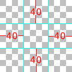

.. _gui:

=======================
GUI 自定义向导
=======================

.. ifconfig:: not renpy_figures

    .. note::

        This version of the documentation has the images omitted to
        save space. To view the full version, please visit
        https://www.renpy.org/doc/html/gui.html

Ren'Py 能够赋予 GUI 系统比单纯的盒子模型更加吸引人，并且能够被自定义化。甚至在需要的时候能够被完全替代。此页面介绍了如何进行初级到中级的 GUI 自定义化。

想要更深入的自定义化，请查阅文档:ref:`styles <styles>` (包括 :ref:`样式特征 <style-properties>`的列表
和 :ref:`屏幕 <screens>` (包含
:ref:`屏幕动作 <screen-actions>` 和 :ref:`特殊屏幕 <screen-special>`).

可能你正在使用 Ren'Py GUI 的新样式(包含在 gui.rpy 文件)。根据这篇向导，旧的 GUI (在 screens.rpy 文件中使用)应该看作进阶的 GUI 自定义化。

简单的 GUI 自定义化
========================

除了最简单的视觉小说，一丁点的 GUI 自定义化都能令游戏作品变得。一般的自定义化使不需要通过编辑 gui.py 来实现的。这些自定义化只是稍微修改一下 GUI 的细节,并不会对于 GUI 的外观大动干戈。

改变尺寸大小的颜色
----------------------

对 GUI 最简单的修改就是改变尺寸大小和颜色。Ren'Py会在你第一次新建项目的时候提醒你进行这些设置，但在启动器里选择 "Change/Update GUI" 能让你修改你之前的设置。

当你通过启动器来修改 GUI 的话，Ren'Py 会在第一次新建项目的时候，提示你选择 GUI 的设定，或者通过修改 gui.rpy。所有的选项会覆盖大多是的图像文件，并且重写 gui.rpy 会重置这些文件的修改。

结果，你可能更想在其他自定义化之前完成这些设置。

Ren'Py 会提示你设置项目默认的分辨率，还有选择要使用的颜色主题。当你都设置好这些选项后，GUI 就会根据你的设定进行更新。

Options.rpy
-----------

在 options.rpy 中有一对使用 gui 代码的变量

:var:`config.name`
    一段字符串，给定了游戏可读的名称。同时也作为游戏窗口的标题，并贯穿了整个 GUI。

:var:`gui.show_name`
    当此变量设置为 False 时，主菜单的游戏标题和版本号就会被隐藏起来。(这是因为标题是内嵌进主菜单的图像中的。)

:var:`config.version`
    一段字符串，表示游戏的版本号，在游戏中多处向玩家展示。

:var:`gui.about`
    游戏中”关于“界面中的附加文本。如果你想在鸣谢列表中使用多行的文本，可以使用 \\n\\n 来分隔段落。

以下是关于定义这些变量的示例::

    define config.name = _('Old School High School')

    define gui.show_name = True

    define config.version = "1.0"

    define gui.about = _("Created by PyTom.\n\nHigh school backgrounds by Mugenjohncel.")

为了简便起见，你可以使用三重引号字符串来定义 gui.about 这个变量，这样你就可以令段落能够分隔开来。 ::

    define gui.about = _("""\
    Created by PyTom.

    High school backgrounds by Mugenjohncel.""")

游戏和主菜单的背景图像
-------------------------------------

可以在 game/gui 目录中找到应用在 GUI 中的图像，可以在启动器中点击 "Open Directory: gui" 来打开。相关文件如下：

gui/main_menu.png
    这个图像文件作为主菜单所有画面的背景。

gui/game_menu.png
    这个图像文件作为游戏菜单所有画面的背景。

.. ifconfig:: renpy_figures

    .. figure:: gui/easy_main_menu.jpg
        :width: 100%

        主菜单的背景图像，只需要替换 gui/main_menu.png 这个文件就可。

    .. figure:: gui/easy_game_menu.jpg
        :width: 100%

        ”关于“画面可以作为游戏菜单的一部分(把 gui/game_menu.png
        作为背景)或者主菜单(把 gui/main_menu.png 作为背景)。两者都可以设置成同一幅图像。

窗口图标
-----------

窗口图标是在运行中的应用中显示 (在类似 Windows 的任务栏或者 Macintosh dock 这些地方上显示)。

可以通过替换 gui/window_icon.png 这个文件来改变窗口图标的样式。

请注意，这只能改变运行中的游戏的窗口上的图标。如果想改变 Windows 的 .exe 可执行文件的图标，和 Macintosh 的应用的图标，请查阅:ref:`build documentation <special-files>`.

中级 GUI 自定义化
==============================

接下来，我们来介绍一下中级的 GUI 自定义化。到了中级程度，我们就能改变游戏中的颜色，字体和图片。一般来说，中级程度的自定义化能够保持画面一致，还有按钮和条框会在相同的位置，当然，通过改变画面来加入新功能也是可行的。

在 gui.rpy 这个文件中有很多变量可以改变 GUI 的自定义化。例如，要想增加对话框中的字体大小，请查看以下这行字段::

    define gui.font_size = 22

如果想要增加或者减少字体大小，可以这样做::

    define gui.font_size = 20

请注意，这些变量的默认值大多与这篇文档上显示的所不同。因为默认值能随游戏中的字体大小和颜色而改变，这些文件中的变量是 gui 额外自定义化中的示例。你最好通过搜索 gui.rpy 来查找有疑问的变量定义 - 比如，"define gui.font_size".

以下一些操作可能会局部地或者完全影响到图像文件。结果是，这些修改只会在更新图像文件后才会生效，你可以通过在启动器中选择 "Change GUI" 选项，并使其重新生成图像文件来实现。(但要注意的是，这样做会覆盖掉你已经修改过的图像文件。)

你可能想在游戏项目差不多完成时在自定义 gui.rpy。当旧的 gui.rpy 文件在新的 Ren'Py 版本下运行时，较新的 gui.rpy 文件可能会增加新的特性并且修复了旧版本的缺陷。所以，过早自定义化 gui 不利于获取版本提升后的增益。

对话框
--------

这里有大量相对简单的自定义化设置去修改对话框的外观形式。首先就是改变文本框。

gui/textbox.png
    这个文件是文本窗口的背景图像，作为对话画面的一部分来显示的。它应该具有与游戏窗口相同的宽度，文本只会占用画面中部60%来显示，剩下的20%宽度是两边的边框。

顺带，还有很多变量是与对话框的自定义有关的。

.. var:: gui.text_color = "#402000"

    对话框文本颜色的设置。

.. var:: gui.default_font = "ArchitectsDaughter.ttf"

    对话框，菜单，输入框和其他游戏内文本的字体设置。字体文件本事应该放置在游戏目录下面。

.. var:: gui.text_size = 33

    对话框文本大小的设置。这可能需要通过增加或者减少大小来适应空格分配中所选择的字体。

.. var:: gui.name_text_size = 45

    角色名称处的字体大小。

默认情况下，角色名称标签是继承祖先元素定义的颜色。当定义角色时可以方便地改变其颜色::

    define e = Character("Eileen", who_color="#104010")

.. ifconfig:: renpy_figures

    .. figure:: oshs/game/gui/textbox.png
        :width: 100%

        文本框背景图像示例。

    .. figure:: gui/easy_say_screen.jpg
        :width: 100%

       文本框背景图像和上文给出的变量设置都可以自定义化对话框。

选项菜单
------------

使用 menu 语句创建可以给作者展示选项菜单。与上文相似，选项画面也有很多相对简单的自定义化。首先介绍的是两个图像文件：

gui/button/choice_idle_background.png
    这个图像是闲置按钮的背景图。

gui/button/choice_hover_background.png
    这个图像是鼠标经过时按钮的背景图。

默认情况下，选项按钮中的文本是位于背景图中部75%的区域中。这里有两个变量能够控制被选中按钮中文本的显示颜色。

.. var:: gui.choice_button_text_idle_color = '#888888'

    这是闲置按钮的文本颜色。

.. var:: gui.choice_text_hover_color = '#0066cc'

    则是选中鼠标经过时按钮的文本颜色。

如果图像不需要修改的话，这些简单的自定义就足够了。如果想要更复杂的自定义化，请查询关于按钮的那一章节，如下。

.. ifconfig:: renpy_figures

    .. figure:: oshs/game/gui/button/choice_idle_background.png
        :width: 100%

        gui/button/idle_background.png 示例图像。

    .. figure:: oshs/game/gui/button/choice_hover_background.png
        :width: 100%

        gui/button/choice_hover_background.png 示例图像。

    .. figure:: gui/easy_choice_screen.jpg
        :width: 100%

        选项画面示例，使用了上文提及的图像文件和设置了给定的变量来进行自定义化。

遮罩图像
--------------

有一对遮罩图像可供使用。它们是用来令背景图像变暗或者变亮，使得按钮和其他用户界面元件更具可读性。这两个图像文件被放置在 overlay 目录下：

gui/overlay/main_menu.png
    用于主菜单画面的遮罩图像。

gui/overlay/game_menu.png
    用于游戏内菜单一类的画面，这一类菜单包括读取游戏，储存游戏，偏好设置，关于，游戏帮助等等。这类遮罩图像可以放置在谈话画面中，甚至是放置在主菜单中。

gui/overlay/confirm.png
    这类遮罩图像用于确定框画面并令背景变暗。

.. ifconfig:: renpy_figures

    这里有遮罩图像的示例，显示了加入遮罩图像后，游戏画面是如何变化的。

    .. figure:: oshs/game/gui/overlay/main_menu.png
        :width: 100%

        gui/overlay/main_menu.png 图像示例。

    .. figure:: oshs/game/gui/overlay/game_menu.png
        :width: 100%

        gui/overlay/game_menu.png 图像示例。

    .. figure:: gui/overlay_main_menu.jpg
        :width: 100%

        修改遮罩图像后的主菜单。

    .. figure:: gui/overlay_game_menu.jpg
        :width: 100%

        修改遮罩图像后的游戏菜单。

字体颜色，字体，和字体大小
-----------------------------

Ren`py 有大量的 GUI 有关的变量可以用于改变字体颜色，字体和文本大小。

.. raw:: html

   
与颜色有关的变量一般应写成十六进制颜色代码，比如像 "#rrggbb" 这样的字符串，与网络浏览器使用的相似。例如，"#663399"就是
   <a href="http://www.economist.com/blogs/babbage/2014/06/digital-remembrance" style="text-decoration: none; color: rebeccapurple">purple</a>的着色。
   网上有很多工具可以创建 HTML 颜色代码，比如<a href="http://htmlcolorcodes.com/color-picker/">这个</a>.

另外， :var:`gui.text_color`, :var:`gui.choice_idle_color`, 和 :var:`gui.choice_hover_color`,
已经在上文提及过，以下是各个变量的介绍

.. var:: gui.accent_color = '#000060'

    GUI 中多处的祖先颜色，包括标题和标签。

.. var:: gui.idle_color = '#606060'

    此颜色用于大部分没有鼠标经过和选择过的按钮。

.. var:: gui.idle_small_color = '#404040'

    此颜色用于没有鼠标经过时的小型文本(比如存档处的储存时间和存档名称，和快捷菜单的按钮)。此颜色经常要比 idle_color 的颜色要明亮或者黯淡，以便于补偿其小尺寸来引起玩家的注意

.. var:: gui.hover_color = '#3284d6'

    此颜色用于 GUI 中鼠标经过时的元素，包括按钮上的文本和滑动条上的手柄(上面可以移动的部分)，还有滚动条。

.. var:: gui.selected_color = '#555555'

    此颜色用于已点击按钮的文本(),它的优先度继承于 hover_color 和 idle_color。

.. var:: gui.insensitive_color = '#8888887f'

    此颜色用于对用户输入不敏感的按钮。(例如，回滚不允许情况下的回滚按钮)

.. var:: gui.interface_text_color = '#404040'

    此颜色用于游戏界面中的静态文本，比如游戏帮助和关于游戏画面中的文本。

.. var:: gui.muted_color = '#6080d0'
.. var:: gui.hover_muted_color = '#8080f0'

    暗哑的颜色，用于滑块，滚动条和滑动条中不表示数值和可视区域的地方(一般只用于生成图像时，但启动器中还没有图像生成出来时。)

除了 :var:`gui.default_font`之外，以下变量被用于文本的字体。这些字体文件必须放置在游戏目录之下。

.. var:: gui.interface_font = "ArchitectsDaughter.ttf"

    此字体用于用户界面元素中的文本，比如主菜单和游戏中菜单，等等。

.. var:: gui.glyph_font = "DejaVuSans.ttf"

    用于符号字体，比如跳转指示中的箭头符号。非衬线字体是这些符号的默认字体，每个 Ren'Py 游戏都自动载入它的。

除了 :var:`gui.text_size` 和 :var:`gui.name_text_size`，以下变量同样是控制文本大小的。

.. var:: gui.interface_text_size = 36

    游戏用户界面中静态文本的大小和游戏界面的按钮文本的默认大小。

.. var:: gui.label_text_size = 45

    游戏界面中章节标签的文本大小

.. var:: gui.notify_text_size = 24

    提示文本的大小

.. var:: gui.title_text_size = 75

    游戏标题的文本大小

.. ifconfig:: renpy_figures

    .. figure:: gui/text.jpg
        :width: 100%

        自定义化文本颜色，文本字体和大小后的游戏菜单。

边框
-------

有很多的 GUI 组件，比如按钮和条块这些使用可拓展尺寸的背景，并用边框对象来使之成型的元素。在讨论怎样自定义化按钮和条块，我们先叙述一下它的工作原理。

Borders are given to the :func:`Frame` displayable.
A Frame takes an image, and divides it into nine parts - the four corners,
the four sides, and the center. The corners always remain the same size,
the left and right sides are stretched vertically, the top and bottom sides
are stretched horizontally, and the center is stretched in both directions.

A Borders object gives the size of each of the borders, in left, top, right,
bottom order. So if the following border image is used:

along with the following borders::

    Borders(40, 40, 40, 40)

one possible result is this:

.. image:: gui/borders1.png

As the child changes size, so will the background.

A Border object can also be given padding, including negative padding that
causes the child to overlap the borders. For example, these borders::

    Borders(40, 40, 40, 40, -20, -20, -20, -20)

allow the child to overlap the sides. Note that due to this overlap, the
result is smaller, since the borders themselves now take up less space.

.. image:: gui/borders2.png

Borders can also be tiled, rather than scaled. This is invoked by variables,
and produces this result.

.. image:: gui/borders3.png

These example images are a bit ugly, since we need to show what's going on.
In practice, this system can produce quite pleasing results. This is the case when
a Frame displayable is used as the background of a frame window holding
user interface components.

These frame windows can be customized in two ways. The first is by changing the
background image file:

gui/frame.png
    The image used as the background of frames windows.

And the second is by customizing variables.

.. var:: gui.frame_borders = Borders(15, 15, 15, 15)

    The borders applied to frame windows.

.. var:: gui.confirm_frame_borders = Borders(60, 60, 60, 60)

    The borders applied to the fame used in the confirm screen.

.. var:: gui.frame_tile = True

    If true, the sides and center of the confirm screen are tiled. If false,
    they are scaled.

.. ifconfig:: renpy_figures

    .. figure:: oshs/game/gui/frame.png
        :width: 100%

        An example gui/frame.png image.

    .. figure:: gui/frame_confirm.jpg
        :width: 100%

        The confirm screen after applying the customizations given
        above.

Buttons
-------

The Ren'Py user interface includes a large number of buttons, buttons
that come in different sizes and that are used for different purposes.
The various kinds of buttons are:

button
    A basic button. Used for navigation within the user interface.

choice_button
    A button used for choices in the in-game menu.

quick_button
    A button, displayed in-game, that is intended to allow quick access
    to the game menu.

navigation_button
    A button used in main and game menu for navigation between screens,
    and to start the game.

page_button
    A button used to switch between pages on the load and save screens.

slot_button
    Buttons that represent file slots, and contain a thumbnail, the save
    time, and an optional save name. These are described in more detail
    below.

radio_button
    A button used for multiple-choice preferences on the preferences
    screen.

check_button
    A button used for toggleable preferences on the preferences screen.

test_button
    A button used to test audio playback on the preferences screen. This
    should be the same height as a horizontal slider.

help_button
    A button used to select what kind of help the player wants.

confirm_button
    A button used on the confirm screen to select yes or no.

nvl_button
    A button used for an NVL-mode menu choice.

The following image files are used to customize button backgrounds,
if they exist.

gui/button/idle_background.png
    The background image used by buttons that are not focused.

gui/button/hover_background.png
    The background image used by buttons that are focused.

gui/button/selected_idle_background.png
    The background image used by buttons that are selected but not
    focused. This is optional, and is used in preference to
    idle_background.png if it exists.

gui/button/selected_hover_background.png
    The background image used by buttons that are selected but not
    focused. This is optional, and is used in preference to
    hover_background.png if it exists.

More specific backgrounds can be given for each kind of button, by
prefixing it with the kind. For example, gui/button/check_idle_background.png
is used as the background of check buttons that are not focused.

Four image files are used as foreground decorations on radio and check
buttons, to indicate if the option is chosen or not.

gui/button/check_foreground.png, gui/button/radio_foreground.png
    These images are used when a check or radio button is not selected.

gui/button/check_selected_foreground.png, gui/button/radio_selected_foreground.png
    These images are used when a check or radio button is selected.

The following variables set various properties of buttons:

.. var:: gui.button_width = None
.. var:: gui.button_height = 64

    The width and height of a button, in pixels. If None, the size is
    automatically determined based on the size of the text inside a button,
    and the borders given below.

.. var:: gui.button_borders = Borders(10, 10, 10, 10)

    The borders surrounding a button, in left, top, right, bottom order.

.. var:: gui.button_tile = True

    If true, the sides and center of the button background are tiled to
    increase or  decrease their size. If false, the sides and center are
    scaled.

.. var:: gui.button_text_font = gui.interface_font
.. var:: gui.button_text_size = gui.interface_text_size

    The font and size of the button text.

.. var:: gui.button_text_idle_color = gui.idle_color
.. var:: gui.button_text_hover_color = gui.hover_color
.. var:: gui.button_text_selected_color = gui.accent_color
.. var:: gui.button_text_insensitive_color = gui.insensitive_color

    The color of the button text in various states.

.. var:: gui.button_text_xalign = 0.0

    The horizontal alignment of the button text. 0.0 is left-aligned,
    0.5 is centered, and 1.0 is right-aligned.

These variables can be prefixed with the button kind to configure a
property for a particular kind of button. For example,
:var:`gui.choice_button_text_idle_color` configures the color of
an idle choice button.

For example, we customize these variables in our sample game.

.. var:: gui.navigation_button_width = 290

    Increases the width of navigation buttons.

.. var:: gui.radio_button_borders = Borders(40, 10, 10, 10)
.. var:: gui.check_button_borders = Borders(40, 10, 10, 10)

    Increases the width of radio and check button borders, leaving extra
    space on the left for the check mark.

.. ifconfig:: renpy_figures

    Here's an example of how the play screen can be customized.

    .. figure:: oshs/game/gui/button/idle_background.png

        An example gui/button/idle_background.png image.

    .. figure:: oshs/game/gui/button/hover_background.png

        An example gui/button/hover_background.png image.

    .. figure:: oshs/game/gui/button/check_foreground.png

        An image that can be used as gui/button/check_foreground.png and
        gui/button/radio_foreground.png.

    .. figure:: oshs/game/gui/button/check_selected_foreground.png

        An image that can be used as gui/button/check_selected_foreground.png and
        gui/button/radio_selected_foreground.png.

    .. figure:: gui/button_preferences.jpg
        :width: 100%

        The preferences screen with the customizations described in this
        section applied.

Save Slot Buttons
------------------

The load and save screens use slot buttons, which are buttons that present
a thumbnail and information about when the file was saved. The following
variables are quite useful when it comes to customizing the size of
the save slots.

.. var:: gui.slot_button_width = 414
.. var:: gui.slot_button_height = 309

    The width and height of the save slot button.

.. var:: gui.slot_button_borders = Borders(15, 15, 15, 15)

    The borders applied to each save slot.

.. var:: config.thumbnail_width = 384
.. var:: config.thumbnail_height = 216

    The width and height of the save thumbnails. Note that these live in
    the config namespace, not the gui namespace. These do not take effect
    until the file is saved and loaded.

.. var:: gui.file_slot_cols = 3
.. var:: gui.file_slot_rows = 2

    The number of columns and rows in the grid of save slots.

There are the background images used for save slots.

gui/button/slot_idle_background.png
    The image used for the background of save slots that are not focused.

gui/button/slot_hover_background.png
    The image used for the background of save slots that arefocused.

.. ifconfig:: renpy_figures

    Putting those to use, we get:

    .. figure:: oshs/game/gui/button/slot_idle_background.png

        An example gui/button/slot_idle_background.png image.

    .. figure:: oshs/game/gui/button/slot_hover_background.png

        An example gui/button/slot/slot_hover_background.png image.

    .. figure:: gui/slot_save.jpg

        The save screen after applying the customizations given in this
        section.

Sliders
-------

Sliders are a type of bar that is used in the preferences screen to
allow the player to adjust preference with a large number of values.
By default, the gui only uses horizontal sliders, but in-game code
may also use vertical sliders.

Sliders are customized with the following images:

gui/slider/horizontal_idle_bar.png, gui/slider/horizontal_hover_bar.png, gui/slider/vertical_idle_bar.png, gui/slider/vertical_hover_bar.png
    Images used for vertical and idle bar backgrounds in idle and
    hover states.

gui/slider/horizontal_idle_thumb.png, gui/slider/horizontal_hover_thumb.png, gui/slider/vertical_idle_thumb.png, gui/slider/vertical_hover_thumb.png
    Images used for the thumb - the movable part of the bar.

The following variables are also used:

.. var:: gui.slider_size = 64

    The height of horizontal sliders, and width of vertical sliders.

.. var:: gui.slider_tile = True

    If true, the frame containing the bar of a slider is tiled. If False,
    if it scaled.

.. var:: gui.slider_borders = Borders(6, 6, 6, 6)
.. var:: gui.vslider_borders = Borders(6, 6, 6, 6)

    The borders that are used with the Frame containing the bar image.

.. ifconfig:: renpy_figures

    Here's an example of how we customize the horizontal slider.

    .. figure:: oshs/game/gui/slider/horizontal_idle_bar.png

        An example gui/slider/horizontal_idle_bar.png image.

    .. figure:: oshs/game/gui/slider/horizontal_hover_bar.png

        An example gui/slider/horizontal_hover_bar.png image.

    .. figure:: oshs/game/gui/slider/horizontal_idle_thumb.png

        An example gui/slider/horizontal_idle_thumb.png image.

    .. figure:: oshs/game/gui/slider/horizontal_hover_thumb.png

        An example gui/slider/horizontal_hover_thumb.png image.

    .. figure:: gui/slider_preferences.jpg
        :width: 100%

        The preferences screen after applying the customizations given in this
        section.

Scrollbars
----------

Scrollbars are bars that are used to scroll viewports. In the gui,
the most obvious place a scrollbar is used is the history screen,
but vertical scrollbars can be used on other screens as well.

Sliders are customized with the following images:

gui/scrollbar/horizontal_idle_bar.png, gui/scrollbar/horizontal_hover_bar.png, gui/scrollbar/vertical_idle_bar.png, gui/scrollbar/vertical_hover_bar.png
    Images used for vertical and idle bar backgrounds in idle and
    hover states.

gui/scrollbar/horizontal_idle_thumb.png, gui/scrollbar/horizontal_hover_thumb.png, gui/scrollbar/vertical_idle_thumb.png, gui/scrollbar/vertical_hover_thumb.png
    Images used for the thumb - the movable part of the bar.

The following variables are also used:

.. var:: gui.scrollbar_size = 24

    The height of horizontal scrollbars, and width of vertical scrollbars.

.. var:: gui.scrollbar_tile = True

    If true, the frame containing the bar of a scrollbar is tiled. If False,
    if it scaled.

.. var:: gui.scrollbar_borders = Borders(10, 6, 10, 6)
.. var:: gui.vscrollbar_borders = Borders(6, 10, 6, 10)

    The borders that are used with the Frame containing the bar image.

.. var:: gui.unscrollable = "hide"

    This controls what to do if the bar is unscrollable. "hide" hides
    the bar, while None keeps it shown.

.. ifconfig:: renpy_figures

    Here's an example of how we customize the vertical scrollbar.

    .. figure:: oshs/game/gui/scrollbar/vertical_idle_bar.png
        :height: 150

        An example gui/scrollbar/vertical_idle_bar.png image.

    .. figure:: oshs/game/gui/scrollbar/vertical_hover_bar.png
        :height: 150

        An example gui/scrollbar/vertical_hover_bar.png image.

    .. figure:: oshs/game/gui/scrollbar/vertical_idle_thumb.png
        :height: 150

        An example gui/scrollbar/vertical_idle_thumb.png image.

    .. figure:: oshs/game/gui/scrollbar/vertical_hover_thumb.png
        :height: 150

        An example gui/scrollbar/vertical_hover_thumb.png image.

    .. figure:: gui/scrollbar_history.jpg
        :width: 100%

        The history screen after applying the customizations given in this
        section.

Bars
----

Plain old bars are used to display a number to the player. They're not
used in the gui, but can be used in creator-defined screens.

A bar can customized by editing the following images:

gui/bar/left.png, gui/bar/bottom.png
    Images that are used for the filled section of horizontal and vertical bars.

gui/bar/right.pbg, gui/bar/top.png
    Images that are used for the filled section of horizontal and vertical bars.

There are also the usual variables that control bars:

.. var:: gui.bar_size = 64

    The height of horizontal bars, and width of vertical bars.

.. var:: gui.bar_tile = False

    If true, the bar images are tiled. If false, the images are linearly
    scaled.

.. var:: gui.bar_borders = Borders(10, 10, 10, 10)
.. var:: gui.vbar_borders = Borders(10, 10, 10, 10)

    The borders that are used with the Frames containing the bar images.

.. ifconfig:: renpy_figures

    Here's an example of how we customize horizontal bars.

    .. figure:: oshs/game/gui/bar/left.png
        :width: 100%

        An example gui/bar/left.png image.

    .. figure:: oshs/game/gui/bar/right.png
        :width: 100%

        An example gui/bar/right.png image.

    .. figure:: gui/bar.jpg
        :width: 100%

        A screen we defined to give an example of a bar.

Skip and Notify
---------------

The skip and notify screens both display frames with messages in them. Both
use custom frame background images:

gui/skip.png
    The background of the skip indicator.

gui/notify.png
    The background of the notify screen.

The variables that control these are:

.. var:: gui.skip_frame_borders = Borders(24, 8, 75, 8)

    The borders of the frame that is used by the skip screen.

.. var:: gui.notify_frame_borders = Borders(24, 8, 60, 8)

    The borders of the frame that is used by the notify screen.

.. var:: gui.skip_ypos = 15

    The vertical position of the skip indicator, in pixels from the top of the
    window.

.. var:: gui.notify_ypos = 68

    The vertical position of the notify message, in pixels from the top of the
    window.

.. ifconfig:: renpy_figures

    Here is an example of customizing the skip and notify screens.

    .. figure:: oshs/game/gui/skip.png
        :width: 100%

        An example gui/skip.png image.

    .. figure:: oshs/game/gui/notify.png
        :width: 100%

        An example gui/notify.png image.

    .. figure:: gui/skip_notify.jpg

        These skip and notify screens in action.

Dialogue, Continued
-------------------

In addition to the simple customizations given above, there are a number
of ways to control how dialogue is presented to the player.

Textbox
^^^^^^^

The textbox (or window) is the window the dialogue is displayed in. In addition
to changing gui/textbox.png, the following variables control how the textbox
is displayed.

.. var: gui.textbox_height = 278

    The height of the textbox window, which should also be the height of gui/
    textbox.png.

.. var: gui.textbox_yalign = 1.0

    The placement of the textbox vertically on the screen. 0.0 is the top,
    0.5 is center, and 1.0 is the bottom.

Name and Namebox
^^^^^^^^^^^^^^^^

The character's name is placed inside a frame that uses gui/namebox.png as
it's background. In addition, there are a number of variables that control
the presentation of the name. The namebox is only show if the speaking character
has a name (an empty name, like " ", counts).

.. var:: gui.name_xpos = 360
.. var:: gui.name_ypos = 0

    The horizontal and vertical positions of the name and namebox. These
    are usually a number of pixels from the left or top side of the textbox.
    Setting a variable to 0.5 centers the name in the textbox (see below).
    These numbers can also be negative - for example, setting gui.name_ypos
    to -22 causes it to be places 22 pixels above the top of the textbox.

.. var:: gui.name_xalign = 0.0

    The horizontal alignment of the character's name. This can be 0.0 for left-
    aligned, 0.5 for centered, and 1.0 for right-aligned. (It's almost always
    0.0 or 0.5) This is used for both the position of the namebox relative
    to gui.name_xpos, and to select the side of of the namebox that is aligned
    with xpos.

.. var:: gui.namebox_width = None
.. var:: gui.namebox_height = None
.. var:: gui.namebox_borders = Borders(5, 5, 5, 5)
.. var:: gui.namebox_tile = False

    These variables control the display of the frame containing the namebox.

Text
^^^^

.. var:: gui.text_xpos = 402
.. var:: gui.text_ypos = 75

    The horizontal and vertical positions of the actual dialogue. These
    are usually a number of pixels from the left or top side of the textbox.
    Setting a variable to 0.5 centers the dialogue in the textbox (see below).

.. var:: gui.text_width = 1116

    This variable gives the maximum width of a line of dialogue, in pixels.
    When dialogue reaches this width, it will be wrapped by Ren'Py.

.. var:: gui.text_xalign = 0.0

    The horizontal alignment of dialogue text. 0.0 is left aligned, 0.5 is
    centered, and 1.0 is right-aligned.

Examples
^^^^^^^^

To center the character's name, use::

    define gui.name_xpos = 0.5
    define gui.name_xalign = 0.5

To center dialogue text, use::

    define gui.text_xpos = 0.5
    define gui.text_xalign = 1.0

Our example game uses this code to customize the centered namebox::

    define gui.namebox_width = 300
    define gui.name_ypos = -22
    define gui.namebox_borders = Borders(15, 7, 15, 7)
    define gui.namebox_tile = True

.. ifconfig:: renpy_figures

    .. figure:: oshs/game/gui/namebox.png

        An example gui/namebox.png image.

    .. figure:: gui/intermediate_dialogue.jpg
        :width: 100%

        The example game, customized with the settings above.

History
-------

There are a few variables that control the way the history screen
is displayed.

.. var:: config.history_length = 250

    The number of blocks of dialogue Ren'Py will keep at history.

.. var:: gui.history_height = 210

    The height of a history entry, in pixels. This can be None to allow
    the height of a history entry to vary at the cost of performance -
    config.history_length may need to be lowered significantly when this
    is None.

.. var:: gui.history_name_xpos = 0.5
.. var:: gui.history_text_xpos = 0.5

    The horizontal positions of the name label and dialogue text. These
    can be a number of pixels from the left side of the history entry,
    or 0.5 to center.

.. var:: gui.history_name_ypos = 0
.. var:: gui.history_text_ypos = 60

    The vertical positions of the name label and dialogue text, relative
    to the top of a history entry, in pixels.

.. var:: gui.history_name_width = 225
.. var:: gui.history_text_width = 1110

    The width of the name label and dialogue text, in pixels.

.. var:: gui.history_name_xalign = 0.5
.. var:: gui.history_text_xalign = 0.5

    This controls the alignment of text and the side of the text that is
    aligned with xpos. 0.0 is left-aligned, 0.5 is center-aligned, 1.0 is
    right-aligned.

.. ifconfig:: renpy_figures

    .. figure:: gui/history.png
        :width: 100%

        The history screen customized with the settings given above.

NVL
---

The nvl screen displays NVL-mode dialogue. There are a number of ways it
can be customized. The first is to customize the NVL-mode background image:

gui/nvl.png
    The background image used in NVL-mode. This should be the same size as
    the game window.

There are also a number of variables that are used to customize the way
nvl-mode text is displayed.

.. var:: gui.nvl_borders = Borders(0, 15, 0, 30)

    The borders around the background of the NVL-mode. Since the
    background is not a frame, this is only used to pad out the NVL-mode
    to prevent it from pressing up against the sides of the screen.

.. var:: gui.nvl_height = 173

    The height of a single NVL-mode entry. Setting this to a fixed height
    makes it possible to have NVL-mode without paging, showing a fixed number
    of entries at once. Setting this to None allows entries to be of a
    variable size.

.. var:: gui.nvl_spacing = 15

    The spacing beween entries when gui.nvl_height is None, and the spacing
    between NVL-mode menu buttons.

.. var:: gui.nvl_name_xpos = 0.5
.. var:: gui.nvl_text_xpos = 0.5
.. var:: gui.nvl_thought_xpos = 0.5

    The positioning of character names, dialogue text, and thought/narration
    text, relative to the left side of the entry. This can be a number of
    pixels, or 0.5 to represent the center of the entry.

.. var:: gui.nvl_name_xalign = 0.5
.. var:: gui.nvl_text_xalign = 0.5
.. var:: gui.nvl_thought_xalign = 0.5

    The alignment of the text. This controls both the alignment of the text,
    and the side of the text that is placed at xpos. This can be 0.0 for left,
    0.5 for center, and 1.0 for right.

.. var:: gui.nvl_name_ypos = 0
.. var:: gui.nvl_text_ypos = 60
.. var:: gui.nvl_thought_ypos = 0

    The position of character names, dialogue text, and thought/narration text,
    relative to the top of the entry. This should be a number of pixels from
    the top.

.. var:: gui.nvl_name_width = 740
.. var:: gui.nvl_text_width = 740
.. var:: gui.nvl_thought_width = 740

    The width of each kind of text, in pixels.

.. var:: gui.nvl_button_xpos = 0.5
.. var:: gui.nvl_button_xalign = 0.5

    The position and alignment of NVL-mode menu buttons.

Ren'Py does not use NVL-mode by default. It must be invoked using NVL-mode
characters, and by defining a few variables in script.rpy. ::

    define e = Character("Eileen", kind=nvl)
    define narrator = nvl_narrator
    define menu = nvl_menu

.. ifconfig:: renpy_figures

    Here's an example of the NVL screen customized with the code above.

    .. figure:: oshs/game/gui/nvl.png

        An example gui/nvl.png image.

    .. figure:: gui/nvl.jpg
        :width: 100%

        The example game, customized with the settings above.

Translation and GUI Variables
-----------------------------

The gui namespace is special, in that it is saved after the init phase,
but before any translate python blocks are run. This makes it possible to
change any gui variable in a translate python block to accomodate a second
language. For example, the following code change the default text font
and size.

    translate japanese python:
        gui.default_font = "MTLc3m.ttf"
        gui.text_size = 24

There is one issue that translators need to be aware of, and that is that
in some places in gui.rpy, one variable is assigned the value of another.
For example, the default gui.rpy has::

    define gui.interface_font = "DejaVuSans.ttf"

and later on::

    define gui.button_text_font = gui.interface_font

Since both of these statements run before any translate block runs, both
variables need to be changed. ::

    translate japanese python::

        define gui.interface_font = "MTLc3m.ttf"
        define gui.button_text_font = "MTLc3m.ttf"

If the second statement was missing, DejaVuSans would still be used.

Advanced Customization
======================

More advanced customization is possible by customizing screens.rpy,
up to and including deleting it entirely and replacing it with
your own code. Here are a few places to get started.

Styles
------

:ref:`Styles <styles>` and :ref:`style properties <style-properties>` control how displayables
are displayed. To find out what style a displayable is using, put the mouse
over it and type shift+I. This invokes the style inspector, which shows
style names. Once the style name is known, a style statement can be used
to customize it.

For example, say we've lost our minds writing gui documentation, and want to
add a bright red outline to the dialogue text. We can hover the text and press
shift+I to find out the style used is named say_dialogue. We can then
add (to the end of screens.rpy, or somewhere in options.rpy) the style statement::

    style say_dialogue:
        outlines [ (1, "#f00", 0, 0 ) ]

A huge number of customizations are possible using style statements.

Screens - Navigation
--------------------

The next level of customization is to modify the screens. The most
important documentation about screens is located in the :ref:`screens`
and  :ref:`screen-actions` sections.

One of the most important screens is the navigation screen, which serves
both as the main menu, and to provide navigation for the game menu. This
screen can be edited to add more buttons to one or both of those. For
example, by changing the navigation screen to::

    screen navigation():

        vbox:
            style_prefix "navigation"

            xpos gui.navigation_xpos
            yalign 0.5

            spacing gui.navigation_spacing

            if main_menu:

                textbutton _("Start") action Start()

                textbutton _("Prologue") action Start("prologue")

            else:

                textbutton _("Codex") action ShowMenu("codex")

                textbutton _("History") action ShowMenu("history")

                textbutton _("Save") action ShowMenu("save")

            textbutton _("Load") action ShowMenu("load")

            textbutton _("Preferences") action ShowMenu("preferences")

            if _in_replay:

                textbutton _("End Replay") action EndReplay(confirm=True)

            elif not main_menu:

                textbutton _("Main Menu") action MainMenu()

            textbutton _("About") action ShowMenu("about")

            textbutton _("Extras") action ShowMenu("extras")

            if renpy.variant("pc"):

                textbutton _("Help") action ShowMenu("help")

                textbutton _("Quit") action Quit(confirm=not main_menu)

We add access to a prologue screen from the main menu, a codex screen from
the game menu, and an extras screen from both menus.

Screens - Game Menu
-------------------

Custom game menu screens can also be created. These screens can use the
game_menu screen to provide a title and scrollable viewport. An minimal
custom game menu screen is::

    screen codex():

        tag menu

        use game_menu(_("Codex"), scroll="viewport"):

            style_prefix "codex"

            has vbox:
                spacing 20

            text _("{b}Mechanical Engineering:{/b} Where we learn to build things like missiles and bombs.")

            text _("{b}Civil Engineering:{/b} Where we learn to build targets.")

Clearly, a functional codex would need to be more elaborate than this.

Note
the "tag menu" line. This line is important, as it hides other menu screens
when the codex is shown. Without it, it would be hard to switch to and
from the other menu screens.

Screens - Click to Continue
---------------------------

A screen we expect to be commonly added is the click to continue screen. This
is a screen that is shown when text finishes displaying. Here's a simple
example::

    screen ctc():

        frame:
            at ctc_appear
            xalign .99
            yalign .99

            text _("(click to continue)"):
                size 18

    transform ctc_appear:
        alpha 0.0
        pause 5.0
        linear 0.5 alpha 1.0

This particular ctc screen uses a transform to show the frame after 5 seconds.
It's a good idea to delay CTC animations for several seconds, to give Ren'Py
time to predict and load images.

Total GUI Replacement
---------------------

Advanced creators can replace some or all of screens.rpy in its entirely.
When doing so, some or all of the code in gui.rpy may become redundant.
It's probably a good idea to call :func:`gui.init` to reset styles - but after
that, a creator can do whatever they want. It usually makes sense to include
some or all of the :ref:`special screens <screen-special>`, to make sure
players can have access to all the functionality Ren'Py provides.

Python Functions
================

There are some Python functions that support gui code.

.. include:: inc/gui

