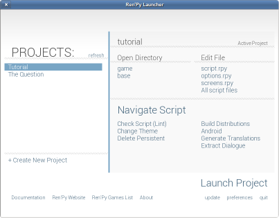

快速开始
==========

欢迎来到Ren'Py的快速开始手册。 这份手册是为了让你只需要几个简单步骤的拼凑就能创作出Ren'Py游戏。我们会展示怎样用拼凑的方法创作出 *The
Question*这样一款简单的游戏。这份手册包含着多个示例，同时也是示例游戏中的一部分。

Ren'Py 启动器
-------------------

在你开始创作游戏之前，应该首先花点时间了解一下Ren'Py启动器是怎样运作的。启动器让你可以新建，管理，修改和运行Ren'Py游戏项目。

**开始入门** 你应该通过`下载 Ren'Py<https://www.renpy.org/latest.html>`_来开始入门.

当下载Ren'Py完毕，你可能会想解压缩它。This can
generally be done by right-clicking on the package file, and picking
"Extract" if that's an option, or "Open" if it's not. Follow the
prompts, and you'll have a working copy of Ren'Py.

.. 注意::

    请确保你已经把解压缩至硬盘上所在的文件夹中(或目录中)。如果你尝试着在ZIP文件内运行它，可能会出现不能正常工作的问题。

当你把Ren'Py解压完毕后，你将要运行一下的程序。

* 在Windows系统上，运行``renpy``或者``renpy.exe``程序。
* 在Mac OS X系统上，运行``renpy``应用。
* 在Linux系统上，运行``renpy.sh``脚本。

运行之后，Ren'Py启动器应该就会运行。

Ren'Py启动器已经被多种语言翻译。要想改变界面语言，选择"preferences"并选择对应的语言。

**选择并启动项目** 你最好先看一下完整的示例游戏
*The Question*是怎样的。通过启动Ren'Py
启动器，并在开始屏幕中选择"The Question"，选择
启动项目"来启动*The Question*游戏。

你可以用同样的方式回到Ren'Py demo，但要选择"Tutorial"而不是"The Question"。

**创建一个新项目**
从启动器中选择"Create New Project"来创建一个新项目。启动器会询问你为项目起的名称。因为
"The Question"这个名称已经被占用了，你应该输入其他不同的名称诸如
"My Question"这样的。接下来，启动器会询问你为项目选择一个颜色主题。在这一点上，你选择什么颜色主题是没有多大问题的，只要从显示出来的主题中选择即可。然后你就会返回到启动器的最初菜单，此时已经生成了你刚刚新建的游戏了。

一个简单的游戏示例
-------------

::

    label start:
        "I'll ask her..."

        "Me" "Um... will you..."
        "Me" "Will you be my artist for a visual novel?"

        "Silence."
        "She is shocked, and then..."

        "Sylvie" "Sure, but what is a \"visual novel?\""

这可能时最简单的Ren'Py游戏之一了。虽然这不包含任何的图片或者其他元素，但它展示了两个角色之间的对话了

你可以动手实践一遍，打开启动器，选择"My Question
Project"，并在 Edit File 一栏选择"script.rpy"这个脚本文件。Ren'Py会让你选择一个文本编辑器，然后会下载你所选择的文本编辑器。当下载完成后，script.rpy会在编辑器中打开。清除 script.rpy 中的所有内容,因为要从拼凑开始,不需要现成的这些东西。把上面的代码复制到 script.rpy 中，并保存。

到现在你已经可以准备运行这个示例项目了。回到启动器，并选择"Launch Project"。Ren'Py将会启动，注意,即使没有额外的工作，Ren'Py仍会给予你菜单以便于加载和保存游戏，并改变不同的偏好设置。准备好的话，点击"Launch Project"，就可以游玩这个示例游戏了。

这个示例游戏展示了一些常用的Ren'Py语句。

第一行是一个 label 语句。label语句用于给程序中的一段建立一个名称。在这个例子中，我们新建了 label 名称``start``. 这个 start label 比较特殊,用户在游戏主菜单中点击了"Start Game"后，这个Ren'Py脚本从这里开始运行。

另外一行是 say 语句，它具有两种形式。第一种是它自己本身是一行字符串 (由双引号开始，包含一连串的字符，并以双引号结束)，用于旁白和主角的内心想法。第二种时包含两组字符串。它用于对话，第一个字符串时角色的名字，第二个是角色说话的内容。

请留意所有的 say 语句都被缩进了四个空格的位置。这是因为它们都从属于 label 语句。在 Ren'Py 之中，
代码区块必须相对于优先语句进行缩进，而且，代码区快中的所有语句都必须以相同的宽度进行缩进。

如果字符串里面包含双引号这个字符，这个字符必须在前面添加一个反斜杠字符。示例中的最后一行就是这样做。

虽然这个简单的示例游戏看上去有些空洞，但这说明了在Ren'Py中做出什么东西来是多么简单。我们将会为其添加一点图片，但首先，让我们来了解一下如何声明角色。

Init
----

init 语句用于在脚本运行前执行一些 Ren'Py 语句的代码块。Init 区块被用于定义图像和角色，设置一些恒定的游戏数据结构，和定制 Ren'Py 。init
区块中的代码不应该与用户进行交互或者改变不同的层， 所以不应该包含 say, menu, scene, show, 或者 hide 语句, 和调用能实现类似功能的函数。

一个 init 语句由关键词 init 开始, 后面接着一个可选的表示优先度的数字，和一个必须写上的冒号. 如果优先度没有给定，会默认设置为0。优先度数字应该在-999到999之间的范围内。超过这个范围的数字会被反转。

优先度数字被用于确定在 init 区块中代码的执行时间。Init 区块会以优先度从低到高的顺序执行。在一个文件当中，具有相同优先度的 init 区块会以文件的顶部到底部的顺序执行。而文件间，拥有相同优先度的优先度区块的赋值顺序则是不确定的。

在特殊的 init 时期，所有 init 区块都只运行一次。 控制器运行到在普通执行中的 init 区块的结尾时，该区块的执行就结束了。如果 init 语句是在普通执行时遇到，init 区块就不能运行。取而代之的是，控制器跳过了下一个语句。

角色
----------

第一个示例中存在着一个问题，就是需要你不断重复地在每次角色说话前输入他们的名称。在一个大量对话的游戏里，就需要多次重复的输入。然而，所有角色名称子啊表现出来是都是一样的，所以输入这些重复文字真是无趣乏味。为了安排这些名称，Ren'Py 能让你以更佳的方式区定义角色。这就是用简称与名称相关联，并改变角色名称对应的显示颜色。

::

    define s = Character('Sylvie', color="#c8ffc8")
    define m = Character('Me', color="#c8c8ff")

    label start:
        "I'll ask her..."

        m "Um... will you..."
        m "Will you be my artist for a visual novel?"

        "Silence."
        "She is shocked, and then..."

        s "Sure, but what is a \"visual novel?\""

The first and and second lines define characters. The first line
defines a character with the short name of "s", the long name
"Sylvie", with a name that is shown in a greenish color. (The colors
are red-green-blue hex triples, as used in web pages.)

The second line creates a character with a short name "m", a long name
"Me", with the name shown in a reddish color. Other characters can be
defined by copying one of the character lines, and changing the short
name, long name, and color.

We've also changed the say statements to use character objects instead
of a character name string. This tells Ren'Py to use the characters we
defined in the init block.

图像
------

A visual novel isn't much of a visual novel without pictures. Let's
add some pictures to our game.

::

    image bg meadow = "meadow.jpg"
    image bg uni = "uni.jpg"

    image sylvie smile = "sylvie_smile.png"
    image sylvie surprised = "sylvie_surprised.png"

    define s = Character('Sylvie', color="#c8ffc8")
    define m = Character('Me', color="#c8c8ff")

    label start:
        scene bg meadow
        show sylvie smile

        "I'll ask her..."

        m "Um... will you..."
        m "Will you be my artist for a visual novel?"

        show sylvie surprised

        "Silence."
        "She is shocked, and then..."

        show sylvie smile

        s "Sure, but what is a \"visual novel?\""

The first new thing we needed to do was to declare the images, using
image statements on lines 2, 3, 5, and 6, inside the init block. These
image statements give an image name, and the filename the image is
found in.

For example, line 5 declares an image named "sylvie smile", found in
the filename "sylvie_smile.png", with the tag "sylvie".

We have a scene statement on line 12. This statement clears out the
screen, and shows the "bg meadow" image. The next line is a show
statement, which shows the "sylvie smile" image on the screen.

The first part of an image name is the image tag. If an image is being
shown, and another image with the same tag is on the screen, then the
image that's on the screen is replaced with the one being shown. This
happens on line 19, the second show statement. Before line 19 is run,
the image "sylvie smile" is on the screen. When line 19 is run, that
image is replaces with "sylvie surprised", since they share the
"sylvie" tag.

For Ren'Py to find the image files, they need to be placed in the game
directory of the current project. The game directory can be found at
"`Project-Name`/game/", or by clicking the "Game Directory" button in
the launcher. You'll probably want to copy the image files from the
"the_question/game/" directory into the "my_question/game/" directory,
so you can run this example.

Ren'Py does not make any distinction between character and background
art, as they're both treated as images. In general, character art
needs to be transparent, which means it should be a PNG or WEBP
file. Background art can be JPEG, PNG, or WEBP files. By convention,
background images start with the "bg" tag.

**Hide Statement.**
Ren'Py also supports a hide statement, which hides the given image.

::

    label leaving:

        s "I'll get right on it!"

        hide sylvie

        "..."

        m "That wasn't what I meant!"

It's actually pretty rare that you'll need to use hide. Show can be
used when a character is changing emotions, while scene is used when
everyone leaves. You only need to use hide when a character leaves and
the scene stays the same.

过渡效果
-----------

Simply having pictures pop in and out is boring, so Ren'Py implements
transitions that can make changes to the screen more
interesting. Transitions change the screen from what it looked like at
the end of the last interaction (dialogue, menu, or transition), to
what it looks like after any scene, show, and hide statements.

::

    label start:
        scene bg uni
        show sylvie smile

        s "Oh, hi, do we walk home together?"
        m "Yes..."
        "I said and my voice was already shaking."

        scene bg meadow
        with fade

        "We reached the meadows just outside our hometown."
        "Autumn was so beautiful here."
        "When we were children, we often played here."
        m "Hey... ummm..."

        show sylvie smile
        with dissolve

        "She turned to me and smiled."
        "I'll ask her..."
        m "Ummm... will you..."
        m "Will you be my artist for a visual novel?"

The with statement takes the name of a transition to use. The most
common one is ``dissolve`` which dissolves from one screen to the
next. Another useful transition is ``fade`` which fades the
screen to black, and then fades in the new screen.

When a transition is placed after multiple scene, show, or hide
statements, it applies to them all at once. If you were to write::

    ###
        scene bg meadow
        show sylvie smile
        with dissolve

Both the "bg meadow" and "sylvie smiles" would be dissolved in at the
same time. To dissolve them in one at a time, you need to write two
with statements::

    ###
        scene bg meadow
        with dissolve
        show sylvie smile
        with dissolve

This first dissolves in the meadow, and then dissolves in sylvie. If
you wanted to instantly show the meadow, and then show sylvie, you
could write::

    ###
        scene bg meadow
        with None
        show sylvie smile
        with dissolve

Here, None is used to indicate a special transition that updates
Ren'Py's idea of what the prior screen was, without actually showing
anything to the user.

位置
---------

By default, images are shown centered horizontally, and with their
bottom edge touching the bottom of the screen. This is usually okay
for backgrounds and single characters, but when showing more than one
character on the screen it probably makes sense to do it at another
position. It also might make sense to reposition a character for story
purposes.

::

   ###
        show sylvie smile at right

To do this repositioning, add an at-clause to a show statement. The at
clause takes a position, and shows the image at that position. Ren'Py
includes several pre-defined positions: ``left`` for the left side of
the screen, ``right`` for the right side, ``center`` for centered
horizontally (the default), and ``truecenter`` for centered
horizontally and vertically.

A user can define their own positions, and event complicated moves,
but that's outside of the scope of this quickstart.

音乐和声效
---------------

Most games play music in the background. Music is played with the play music
statement. It can take either a string containing a filename, or a list of filenames
to be played. When the list is given, the item of it is played in order. ::

    ###
        play music "illurock.ogg"
        play music ["1.ogg", "2.ogg"]

When changing music, one can supply a fadeout and a fadein clause, which
are used to fade out the old music and fade in the new music. ::

    ###
        play music "illurock.ogg" fadeout 1.0 fadein 1.0

And if you supply a loop clause, it loops. if you supply a noloop clause, it
doesn't loop. In Ren'Py, music files automatically loop until they are stopped
by the user. ::

    ###
        play music "illurock.ogg" loop
        play music "illurock.ogg" noloop

Music can be stopped with the stop music statement, which can also
optionally take a fadeout clause. ::

    ###
        stop music

Sound effects can be played with the play sound statement. It defaults to not looping. ::

    ###
        play sound "effect.ogg"

The play sound statement can have same clauses with the play music statement.

Ren'Py support many formats for sound and music, but OGG Vorbis is
preferred. Like image files, sound and music files must be placed in
the game directory.

Pause 语句
---------------

The pause statement causes Ren'Py to pause until the mouse is clicked. If the
optional expression is given, it will be evaluated to a number, and the pause
will automatically terminate once that number of seconds has elapsed.

结束游戏
---------------

You can end the game by running the return statement, without having
called anything. Before doing this, it's best to put something in the
game that indicates that the game is ending, and perhaps giving the
user an ending number or ending name. ::

    ###
        ".:. Good Ending."

        return

That's all you need to make a kinetic novel, a game without any
choices in it. Now, we'll look at what it takes to make a game that
presents menus to the user.

菜单, 标签, 和跳转
-------------------------

The menu statement lets you present a choice to the user::

    ###
        s "Sure, but what's a \"visual novel?\""

    menu:
        "It's a story with pictures.":
             jump vn

        "It's a hentai game.":
             jump hentai

    label vn:
        m "It's a story with pictures and music."
        jump marry

    label hentai:
        m "Why it's a game with lots of sex."
        jump marry

    label marry:
        scene black
        with dissolve

        "--- years later ---"

This example shows how menus are used with Ren'Py. The menu statement
introduces an in-game-menu. The menu statement takes a block of lines,
each consisting of a string followed by a colon. These are the menu
choices which are presented to the user. Each menu choice should be
followed by a block of one or more Ren'Py statements. When a choice is
chosen, the statements following it are run.

In our example, each menu choice runs a jump statement. The jump
statement transfers control to a label defined using the label
statement. The code following that label is run.

In our example above, after Sylvie asks her question, the user is
presented with a menu containing two choices. If the user picks "It's
a story with pictures.", the first jump statement is run, and control
is transferred to the ``vn`` label. This will cause the pov character to
say "It's a story with pictures and music.", after which control is
transferred to the ``marry`` label.

Labels may be defined in any file that is in the game directory, and
ends with .rpy. The filename doesn't matter to Ren'Py, only the labels
contained within it. A label may only appear in a single file.

Python and If Statements
------------------------

While simple (and even fairly complex) games can be made using only
using menus and jump statements, after a point it becomes necessary to
store the user's choices in variables, and access them again
later. This is what Ren'Py's python support is for.

Python support can be accessed in two ways. A line beginning with a
dollar-sign is a single-line python statement, while the keyword
"python:" is used to introduce a block of python statements.

Python makes it easy to store flags in response to user input. Just
initialize the flag at the start of the game::

    label start:
        $ bl_game = False

You can then change the flag in code that is chosen by menus::

    label hentai:

        $ bl_game = True

        m "Why it's a game with lots of sex."
        s "You mean, like a boy's love game?"
        s "I've always wanted to make one of those."
        s "I'll get right on it!"

        jump marry

And check it later::

        "And so, we became a visual novel creating team."
        "We made games and had a lot of fun making them."

        if bl_game:
            "Well, apart from that boy's love game she insisted on making."

        "And one day..."

Of course, python variables need not be simple True/False values. They
can be arbitrary python values. They can be used to store the player's
name, to store a points score, or for any other purpose. Since Ren'Py
includes the ability to use the full Python programming language, many
things are possible.

Releasing Your Game
-------------------

Once you've made a game, there are a number of things you should do
before releasing it:

**Check for a new version of Ren'Py.**
   New versions of Ren'Py are released on a regular basis, to fix bugs
   and add new features. Before releasing, click update in the launcher
   to update Ren'Py to the latest version. You can also download new
   versions and view a list of changes at
   `http://www.renpy.org/latest.html <http://www.renpy.org/latest.html>`_.

**Check the Script.**
   From the front page of the launcher, choose "Check Script
   (Lint)". This will check your games for errors that may affect some
   users. These errors can affect users on the Mac and Linux
   platforms, so it's important to fix them all, even if you don't see
   them on your computer.

**Build Distributions.**
   From the front page of the launcher, choose "Build Distributions". Based
   on the information contained in options.rpy, the launcher will build one
   or more archive files containing your game.

**Test.**
   Lint is not a substitute for thorough testing. It's your
   responsibility to check your game before it is released. Consider asking
   friends to help beta-test your game, as often a tester can find problems
   you can't.

**Release.**
   You should post the generated files (for Windows, Mac, and Linux) up
   on the web somewhere, and tell people where to download them
   from. Congratulations, you've released a game!

   Please also add your released game to our `games database <http://games.renpy.org>`_,
   so we can keep track of the Ren'Py games being made.

Script of The Question
-----------------------

You can view the full script of ''The Question'' :ref:`here <thequestion>`.

Where do we go from here?
-------------------------

This Quickstart has barely scratched the surface of what Ren'Py is
capable of. For simplicity's sake, we've omitted many features Ren'Py
supports. To get a feel for what Ren'Py is capable of, we suggest
playing through the Tutorial, and having Eileen demonstrate these features
to you.

You may also want to read the rest of this (complex) manual, as it's
the definitive guide to Ren'Py.

On the Ren'Py website, there's the a `FAQ <http://www.renpy.org/wiki/renpy/doc/FAQ>`_ giving answers to
common questions, and a `Cookbook <http://www.renpy.org/wiki/renpy/doc/cookbook/Cookbook>`_ giving
useful code snippets. If you have questions, we suggest asking them at
the `Lemma Soft Forums <http://lemmasoft.renai.us/forums/>`_, the
official forum of Ren'Py. This is the central hub of the Ren'Py
community, where we welcome new users and the questions they bring.

Thank you for choosing the Ren'Py visual novel engine. We look forward
to seeing what you create with it!
